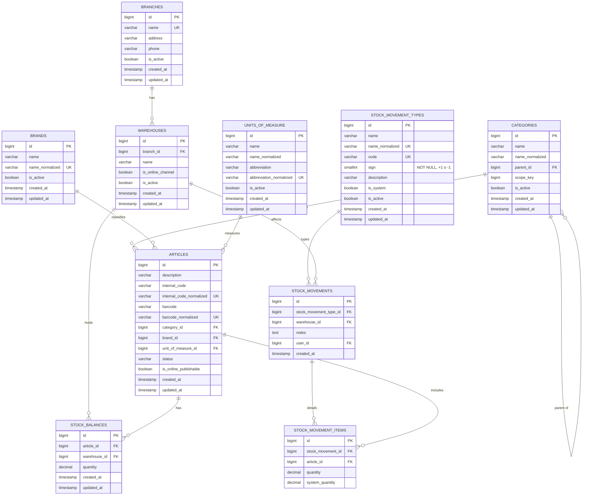

# Sprint Backlog 1 - Supermercados La Linda

**Sprint 1** · viernes 14/08/2026 al viernes 28/08/2026 · equipo de 6 personas
**Compromiso: 27 story points** (capacidad de referencia: 30 a 40 SP)

> **El compromiso bajó de 33 a 27 SP el 2026-08-22**, en dos correcciones del PO que insistió en
> priorizar exclusivamente artículos y stock, sin invertir tiempo en nada que él no hubiera pedido.
> Salieron puntos de venta (`HU-051`), alícuotas de IVA y medios de pago (`HU-007`, `HU-052`) y la
> exportación a CSV y Excel (`HU-053`). Ninguna se descartó: todas bajaron de prioridad en
> `product-backlog.md`. Este documento ya refleja lo acordado; el detalle de cada desglose está en
> el backlog y el razonamiento en `git log`.

## Objetivo del sprint

Que el supermercado pueda definir su estructura de sucursales y depósitos y cargar su catálogo de
artículos, y que a partir de ahí **toda existencia sea consultable y corregible únicamente a
través de un movimiento de stock trazable**, con usuario, fecha, tipo y justificación.

El foco es la indicación del Product Owner de arrancar por artículos y stock. Al cierre no hay
compras, ni ventas, ni precios: hay un inventario que no se puede tocar sin dejar rastro.

## Ítems comprometidos

Este documento referencia los ítems **por ID**. Los criterios de aceptación viven únicamente en
`product-backlog.md` y no se copian acá: dos copias divergen apenas alguien refina un criterio a
mitad de sprint, y la desactualizada termina siendo siempre la que sobrevive al sprint. Para el
Excel del entregable, ver la última sección.

| #   | ID     | Título                                              | SP     | Estado    |
| --- | ------ | --------------------------------------------------- | ------ | --------- |
| 1   | HU-005 | Administrar sucursales y depositos                  | 3      | Terminada |
| 2   | HU-006 | Administrar categorias, marcas y unidades de medida | 5      | Terminada |
| 3   | HU-031 | Administrar los tipos de movimiento de stock        | 2      | Terminada |
| 4   | HU-008 | Administrar el catalogo de articulos                | 5      | Terminada |
| 5   | HU-016 | Consultar las existencias por deposito              | 2      | Pendiente |
| 6   | HU-017 | Registrar un movimiento de stock manual            | 8      | Pendiente |
| 7   | HU-018 | Consultar el historial de movimientos de stock      | 2      | Pendiente |
|     |        | **Total**                                           | **27** |           |

El esquema de las tres tablas de stock (`stock_balances`, `stock_movements`,
`stock_movement_items`) ya está mergeado en la rama `feature/esquema-stock-base` del repo de la
aplicación; lo que falta de esas tres historias son los services y las pantallas.

### Orden de ataque

`HU-005`, `HU-006`, `HU-031` y `HU-008` están cerradas. Quedan tres historias, y ninguna depende de
nada de afuera del sprint.

| Orden | Historia | SP | Qué construye |
| ----- | -------- | -- | ------------- |
| 1 | `HU-016` Existencias por depósito | 2 | tabla `stock_balances` + pantalla de consulta con filtros y totales |
| 2 | `HU-017` Movimiento de stock manual | 8 | tablas `stock_movements` y `stock_movement_items` + el service que aplica el movimiento + pantalla de carga |
| 3 | `HU-018` Historial de movimientos | 2 | pantalla de consulta con filtros, paginada |

El orden sale de las dependencias declaradas en `product-backlog.md`: `HU-017` depende de `HU-016`,
y `HU-018` depende de `HU-017`.

**Pero no hace falta terminar una para empezar la siguiente.** Las dependencias son sobre las
tablas, no sobre las pantallas:

- `HU-017` necesita que exista `stock_balances`, porque su service la actualiza. Eso es la
  **migración** de `HU-016`, no su pantalla.
- `HU-018` necesita que existan `stock_movements` y `stock_movement_items` para listar algo. Eso es
  la **migración** de `HU-017`, no su service.

Y las migraciones de `HU-017` ni siquiera esperan a la de `HU-016`: ninguna de las tablas de
movimientos tiene FK a `stock_balances`. Se escriben todas el mismo día.

**Cómo se traduce eso al reparto de una historia por persona:** cada quien sigue siendo dueño de la
suya de punta a punta, y lo único que cambia es el orden interno del trabajo. **La migración y el
modelo son el primer commit, y se pushean apenas pasan, en vez de mergear la historia entera al
final.** Las tres tablas ya están especificadas columna por columna en el DER de más abajo, así que
esa primera parte es transcribir, no diseñar.

```
dia 1, manana:  duenio de HU-016 ──> pushea migracion stock_balances
                duenio de HU-017 ──> pushea migraciones stock_movements
                                     + stock_movement_items
                (no se esperan entre si)

dia 1, tarde en adelante, los tres frentes en paralelo:

   HU-016                    HU-017                    HU-018
   pantalla de existencias   service del ajuste        consulta del historial
   filtros y totales         + pantalla de carga       filtros y paginado
   (2 SP)                    (8 SP, el riesgo)         (2 SP)
```

Dos cosas para acordar en la daily:

- **`HU-017` son 8 SP contra 2 y 2, y somos seis.** Con un dueño por historia, `HU-016` y `HU-018`
  cierran temprano y queda corriendo justo el ítem del que cuelga el resto. Conviene que `HU-017`
  arranque con dos o tres personas, y que quien cierre `HU-016` se sume ahí como par.
- **`HU-018` es el único aguas abajo de verdad.** Puede construir sus filtros y su paginado contra
  la tabla vacía, pero no se puede dar por terminada hasta que el service de `HU-017` genere
  movimientos reales. Si llegado el miércoles 26 el service todavía no aplica movimientos, la
  conversación es con el Product Owner —sacar `HU-018` y cerrar en 25 SP—, nunca un recorte
  silencioso.

## Desglose en tareas

La asignación de responsables se hace en el planning. El desglose asume el stack del proyecto:
Laravel + Inertia.js + React sobre PostgreSQL, desplegado en Laravel Cloud.

### HU-005 - Sucursales y depósitos (3 SP)

- [ ] Migraciones de `sucursales` y `depositos` con sus claves foráneas
- [ ] Modelos y relaciones: sucursal tiene muchos depósitos
- [ ] Validaciones: nombre de sucursal único, depósito pertenece siempre a una sucursal
- [ ] Regla de un único depósito marcado como canal online
- [ ] Bloqueo de baja de sucursal o depósito con existencias o movimientos
- [ ] Pantallas de listado y ABM de las dos entidades
- [ ] Seeder con la estructura de demostración (2 sucursales, 3 depósitos)

> **Sacado de esta historia (corrección del PO, 2026-08-22):** `puntos_venta` no entra este
> sprint, pasó a `HU-051` con menor prioridad. No hay ninguna tarea de este sprint que lo necesite.

### HU-006 - Categorías, marcas y unidades de medida (5 SP)

- [ ] Migraciones de `categorias` (autorreferencial), `marcas` y `unidades_medida`
- [ ] Validación de jerarquía de exactamente dos niveles: una subcategoría no puede tener hijas
- [ ] Nombre único dentro del mismo nivel, abreviatura de unidad única
- [ ] Bloqueo de baja con artículos asociados
- [ ] Pantalla de categorías con visualización del árbol jerárquico
- [ ] ABM de marcas y de unidades de medida
- [ ] Seeder con el juego de categorías, marcas y unidades de demostración

### HU-031 - Tipos de movimiento de stock (2 SP)

- [ ] Migración de `tipos_movimiento` con signo de afectación **obligatorio** (`+1` / `-1`). Sin entidad de `motivos_ajuste`: el detalle descriptivo vive en el nombre del tipo
- [ ] Marcado de los tipos propios del sistema como no eliminables
- [ ] Bloqueo de baja de un tipo ya usado en un movimiento; bloqueo de cambio de signo de un tipo ya usado
- [ ] ABM de tipos de movimiento
- [ ] Seeder con el catálogo de tipos del sistema (automáticos + los de ajuste manual)

### HU-008 - Catálogo de artículos (5 SP)

- [ ] Migración de `articulos` con sus FK a categoría, marca y unidad. **Sin FK a alícuota este sprint** (corrección del PO, 2026-08-22): `alicuotas_iva` no se construye en `HU-007`, que bajó de prioridad, así que la columna `alicuota_iva_id` se agrega recién en el sprint donde entre esa historia
- [ ] **Verificar que el modelo no tenga campo de precio, ni proveedor, ni depósito** (decisión cerrada del PO)
- [ ] Validaciones: obligatorios, código interno único, código de barras único cuando se informa
- [ ] Baja lógica a estado discontinuado cuando hay movimientos asociados
- [ ] Formulario de alta y edición, y listado básico
- [ ] Seeder con artículos de demostración repartidos entre categorías

### HU-016 - Existencias por depósito (2 SP)

- [ ] Migración de `existencias` (artículo + depósito + cantidad), con índice único por el par
- [ ] Consulta con filtros por artículo, categoría, depósito y estado de existencias
- [ ] Totalización por sucursal y total general
- [ ] **Cantidad como campo de sólo lectura: la pantalla no ofrece ninguna vía de edición**

### HU-017 - Movimiento de stock manual (8 SP)

- [ ] Migraciones de `movimientos_stock` (cabecera) y su detalle en relación de muchos a muchos con artículos
- [ ] Servicio de aplicación del movimiento sobre la existencia, dentro de una transacción, que deriva el delta como `tipo.signo * cantidad_ingresada`
- [ ] Validaciones: tipo de movimiento obligatorio del catálogo (y que no sea automático), cantidad ingresada por renglón > 0, existencia resultante no negativa, observaciones obligatorias, al menos un artículo, sin repetidos
- [ ] Registro de usuario responsable, fecha y hora
- [ ] Inmutabilidad: el movimiento confirmado no se edita ni se elimina, ni por pantalla ni por ruta directa
- [ ] Pantalla de carga: elegir tipo (que trae el signo) y cargar sólo la cantidad que entra/sale por artículo. **No se muestra el stock del sistema ni un total/diferencia resultante**
- [ ] **Prueba de que la pantalla sólo pide la cantidad que entra/sale y no ofrece ninguna vía de modificar una cantidad sin generar un movimiento**
- [ ] Prueba de que el intento de editar un movimiento confirmado es rechazado en el servidor
- [ ] `stock_movement_types.sign` es `NOT NULL` (`+1` / `-1`) para todos los tipos, incluidos `warehouse_transfer_out/in`. No existe el estado "varía por renglón"
- [ ] **Seeder del inventario inicial a través del service**, no insertando en `stock_balances`: un movimiento de tipo `initial_load` por depósito, con `system_quantity` = saldo previo y `quantity = +n` — ver la nota de abajo

### HU-018 - Historial de movimientos de stock (2 SP)

- [ ] Consulta con filtros combinables por artículo, depósito, tipo, usuario y rango de fechas
- [ ] Paginación del resultado
- [ ] Navegación desde el movimiento al documento que lo originó, cuando exista
- [ ] Verificación de que no hay acción de editar ni de eliminar en ninguna vista

**Por qué el seeder va por el service (2026-08-22).** `stock_balances` no tiene ruta de escritura:
es la decisión que sostiene el objetivo del sprint entero. Un seeder que inserte existencias
directamente deja datos de demostración que lo contradicen —saldos sin ningún movimiento detrás, y
una pantalla de historial vacía salvo por el único ajuste que se haga en vivo—. Cargando el
inventario inicial por el mismo camino que recorre el usuario, `HU-016` tiene existencias que
mostrar y totalizar y `HU-018` tiene un historial poblado para filtrar y paginar, que es
lo que hace falta para demostrar esas dos historias. Dos consecuencias operativas:

- Verificar que el tipo `initial_load` ("Carga inicial de inventario", signo `+1`) esté entre los
  tipos que siembra el seeder de `HU-031`; si no está, es una fila más.
- El seeder de demostración pasa a depender del service de `HU-017`, así que **no es tarea de la
  fase 0**. Para desarrollar `HU-016` y `HU-018` mientras tanto alcanza con una factory descartable.

### Tareas transversales del sprint

- [ ] DER de las entidades de este sprint validado contra el esquema real (ver sección
      `Diseño de datos (DER)` más abajo)
- [ ] Despliegue del incremento en Laravel Cloud y verificación de que la demo corre sobre el entorno desplegado
- [ ] Capturas de pantalla de todas las interfaces construidas
- [ ] Juego de datos de demostración cargado y coherente entre los seeders

## Diseño de datos (DER)

Motor PostgreSQL en producción, SQLite en desarrollo y tests. Convención del código: nombres de
tabla y columna en inglés, booleanos en vez de `estado` varchar, y columnas `*_normalized` para
comparar sin acentos ni mayúsculas.

**La fuente de verdad del esquema son las migraciones**, no este documento. Lo que vive acá es lo
que las migraciones no explican: por qué el esquema es así. Por eso el diagrama está completo pero
el detalle columna por columna cubre sólo las tres tablas de stock, que son donde están las
decisiones de diseño de este sprint.

**Los `CHECK` se declaran inline en la columna** (`rawColumn`), no con `ALTER TABLE ADD CONSTRAINT`:
SQLite no soporta esa sentencia, y saltearla según el driver dejaría la regla sin testear
justamente donde se testea.

### Diagrama (Mermaid)

Las 11 tablas del sprint: las 8 de datos maestros y las 3 de stock.



`stock_movements.user_id` apunta a `users`, que no se modela acá porque la provee el starter kit
de Laravel (fuera del alcance de este sprint) — por eso no tiene entidad propia en el diagrama.

### Datos maestros — `HU-005`, `HU-006`, `HU-031`, `HU-008`

Siete tablas ya construidas: `branches`, `warehouses`, `categories`, `brands`, `units_of_measure`,
`stock_movement_types` y `articles`. Sus columnas están en el diagrama
de arriba y su definición exacta en las migraciones. Lo que no se lee en el código y conviene tener
escrito son estas decisiones:

- **`*_normalized`** (`name_normalized`, `internal_code_normalized`, `barcode_normalized`,
  `abbreviation_normalized`): columna mantenida por la app para comparar sin distinguir mayúsculas
  ni acentos, en vez de resolverlo con `citext` o una collation especial de Postgres.
- **`categories.scope_key`** resuelve "nombre único dentro del mismo nivel" con un solo
  `UNIQUE(scope_key, name_normalized)`. Vale `parent_id` cuando hay padre y `0` en las categorías
  de primer nivel (`Category.php:95`), lo que evita que Postgres trate cada `NULL` de `parent_id`
  como distinto. Verificado contra el código el 2026-08-23.
- **`warehouses.is_online_channel`** tiene un índice único parcial: a lo sumo un depósito canal
  online en **todo el sistema**, no uno por sucursal. Así lo pide el criterio de `HU-005`.
- **`articles` no tiene precio, ni proveedor, ni depósito** — decisión cerrada del PO. Tampoco
  `alicuota_iva_id`: `HU-007` bajó de prioridad y la columna se agrega recién cuando esa historia
  entre.
- **`stock_movement_types.code`** es la forma de referenciar un tipo sin depender de su nombre. Los
  códigos automáticos (los generan otros módulos) se comparan contra `StockMovementType::CODE_*` /
  `StockMovementType::AUTOMATIC_CODES` (`purchase_entry`, `sale_exit`, `customer_return`,
  `warehouse_transfer_out`, `warehouse_transfer_in`), nunca contra un literal escrito a mano. Todos
  los tipos sembrados son `is_system` y no se pueden eliminar.
- **`stock_movement_types.sign` es `NOT NULL`** (`+1` suma / `-1` resta) para todos los tipos. No
  tiene `CHECK` en la base: los valores admitidos los impone el FormRequest. Ver la nota sobre
  `sign` más abajo.

### Tablas de stock — `HU-016`, `HU-017`, `HU-018`

La parte compleja del sprint, y el motivo de que esta sección exista: acá están las decisiones de
diseño que las migraciones no explican. Los nombres calzan con la familia `stock_` que ya arrancó
en `stock_movement_types`.

> **Revisión post-HU-017 (rediseño de movimientos).** Se eliminó `stock_adjustment_reasons`: el
> detalle descriptivo pasó al nombre del propio tipo de movimiento (catálogo administrable en
> HU-031). `stock_movement_types.sign` es `NOT NULL` para todos los tipos y el service deriva el
> delta como `tipo.signo * cantidad_ingresada` (la cantidad que el usuario tipea siempre es
> positiva). La transferencia se modela con dos tipos de signo fijo, `warehouse_transfer_out`
> (`-1`) y `warehouse_transfer_in` (`+1`). El texto de abajo se conservó como registro del diseño
> previo; donde diga "motivo", "sign nullable" o "varía por renglón", vale esta nota.

#### `stock_balances` — HU-016

| Columna      | Tipo                      | Notas                                         |
| ------------ | ------------------------- | --------------------------------------------- |
| id           | bigserial PK              |                                               |
| article_id   | bigint FK → articles.id   | `NOT NULL`                                    |
| warehouse_id | bigint FK → warehouses.id | `NOT NULL`                                    |
| quantity     | decimal(12, 3)            | `NOT NULL DEFAULT 0`, `CHECK (quantity >= 0)` |
| created_at   | timestamp                 |                                               |
| updated_at   | timestamp                 |                                               |

`UNIQUE(article_id, warehouse_id)`, más un índice sobre `warehouse_id`: `HU-016` lista el stock de
un depósito y Postgres no indexa las claves foráneas por su cuenta.

**No hay ninguna ruta HTTP de escritura directa sobre esta tabla.** La única forma de modificar
`quantity` es el servicio de aplicación de `stock_movements` (HU-017), dentro de una transacción.
Esto es lo que hace cumplible el criterio "la cantidad se muestra como campo de solo lectura, sin
ninguna opción de edición directa": no es una regla de UI, es que no existe endpoint.

Sin `minimum_quantity`: ese campo es de `HU-020`, fuera de este sprint. Por eso el criterio de
`HU-016` tampoco pide ya stock mínimo ni indicador de faltante — se recortaron en
`product-backlog.md` y vuelven cuando `HU-020` entre a un sprint.

#### `stock_movements` — HU-017, HU-018 (cabecera)

| Columna                    | Tipo                                    | Notas                                                                                 |
| -------------------------- | --------------------------------------- | ------------------------------------------------------------------------------------- |
| id                     | bigserial PK                       |                                                                  |
| stock_movement_type_id | bigint FK → stock_movement_types.id | `NOT NULL`                                                       |
| warehouse_id           | bigint FK → warehouses.id           | `NOT NULL` — el depósito afectado por esta fila                  |
| notes                  | text                               | `NULL` — obligatorio a nivel FormRequest para el movimiento manual (justificación) |
| user_id                | bigint FK → users.id               | `NOT NULL` — tabla externa del starter kit, no modelada acá     |
| created_at             | timestamp                          | `NOT NULL DEFAULT now()` — es también la fecha/hora del movimiento |

Índices, todos para los filtros de `HU-018`: `(warehouse_id, created_at)`,
`stock_movement_type_id`, `user_id` y `created_at`. Postgres no indexa las claves foráneas por su
cuenta.

**Sin `updated_at`, a propósito.** La inmutabilidad del movimiento confirmado (`HU-017`) se
sostiene arquitectónicamente —no hay ruta `PUT`/`PATCH`/`DELETE` para este recurso en ningún
controller—, no con un flag de estado tipo `confirmed`. Quitar la columna además de la ruta hace
la intención visible en el propio esquema: no hay ni dónde guardar una edición. Para este sprint,
el alta del registro **es** la confirmación; no hay un paso previo de borrador, así que
`created_at` alcanza como fecha/hora del movimiento sin necesitar una columna aparte.

Para `HU-017` en este sprint, todo movimiento nace con `warehouse_id` = el depósito del ajuste.
**Una fila = un depósito afectado**, y esa invariante vale para todos los tipos de movimiento que
vengan después.

**Sin columna para agrupar las dos filas de una transferencia.** Se evaluaron un
`linked_movement_id` self-FK y un `transfer_group_id uuid`, y no entró ninguno: `HU-019` no está en
este sprint, nadie escribiría esa columna, y cuando la historia entre lo más probable es que la
agrupación sea una FK a una cabecera `stock_transfers` — que además es el documento al que `HU-018`
pide navegar. Vale la misma regla que con `articles.alicuota_iva_id`: **la columna se agrega en el
sprint donde entra la historia que la usa.**

**Cómo se distingue una transferencia de cualquier otro movimiento:** por
`stock_movement_types.code`, y sólo por ahí. **El signo de `quantity` no identifica el tipo** —una
venta también es negativa y un ajuste puede serlo—, y "tener clave de agrupación no nula" tampoco:
eso sería consecuencia del tipo, no su definición.

Con una fila por depósito afectado, el "depósito de origen / depósito de destino" que pide `HU-018`
se deriva del tipo al momento de la consulta:

| Tipo                                            | Origen                | Destino               |
| ----------------------------------------------- | --------------------- | --------------------- |
| Ajuste manual (`HU-017`)                        | `warehouse_id`        | `warehouse_id`        |
| Transferencia, tipo `warehouse_transfer_out`    | `warehouse_id`        | el de la fila hermana |
| Transferencia, tipo `warehouse_transfer_in`     | el de la fila hermana | `warehouse_id`        |
| Entrada por compra (`HU-026`)                   | — (proveedor)         | `warehouse_id`        |
| Salida por venta                                | `warehouse_id`        | — (cliente)           |

Las dos filas de una transferencia se distinguen por su tipo (`warehouse_transfer_out` /
`warehouse_transfer_in`), cada uno con su signo fijo; el invariante a validar cuando `HU-019` entre
es que los dos deltas sumen cero.

#### Sobre `stock_movement_types.sign`

**Todo tipo tiene `sign` fijo (`NOT NULL`, `+1` o `-1`).** Al registrar un movimiento manual el
service deriva el delta una sola vez como `tipo.signo * cantidad_ingresada` (el usuario siempre
tipea una cantidad positiva) y lo persiste en `stock_movement_items.quantity`. A partir de ahí los
saldos se recalculan **desde el delta almacenado, nunca desde el signo del tipo**: el tipo es dato
editable por el usuario (ABM de `HU-031`), así que calcular saldos con él dejaría que editar un
tipo reescribiera el efecto de todo su historial. La fuente de verdad del signo sigue siendo
`stock_movement_items.quantity`.

Está impedido cambiar el signo de un tipo con movimientos registrados
(`StockMovementType::isInUse()` en `UpdateStockMovementType`), que es lo que evita que el
significado de un tipo cambie a mitad de camino. Los tipos automáticos
(`StockMovementType::AUTOMATIC_CODES`) no se pueden elegir en la pantalla de carga manual.

#### `stock_movement_items` — HU-017, HU-018 (detalle, muchos a muchos)

| Columna           | Tipo                           | Notas                                                                                           |
| ----------------- | ------------------------------ | ----------------------------------------------------------------------------------------------- |
| id                | bigserial PK                   |                                                                                                 |
| stock_movement_id | bigint FK → stock_movements.id | `NOT NULL`                                                                                      |
| article_id        | bigint FK → articles.id        | `NOT NULL`                                                                                      |
| quantity          | decimal(12, 3)                 | `NOT NULL`, `CHECK (quantity <> 0)` — delta con signo: negativo egresa, positivo ingresa        |
| system_quantity   | decimal(12, 3)                 | `NULL` — foto de `stock_balances.quantity` previa al movimiento; la llena sólo el ajuste manual |

`UNIQUE(stock_movement_id, article_id)` — cumple "un artículo no puede repetirse dentro del mismo
ajuste". Más un índice sobre `article_id`, que es uno de los filtros de `HU-018`.

Esta es la tabla que hace concreta la decisión cerrada del PO de modelar el detalle de las
operaciones como relación de muchos a muchos entre `stock_movements` y `articles`.

**Por qué `decimal(12, 3)` y no `integer`.** `UnitOfMeasureSeeder` siembra Kilogramo y Litro entre
las unidades válidas, así que con enteros no se puede stockear 1,5 kg de un artículo a granel — en
un supermercado eso es la fiambrería y la verdulería, no un caso de borde. Alcanza a las **tres**
columnas de cantidad, `stock_balances.quantity` incluida: si el detalle guardara decimales y el
balance fuera entero, el upsert truncaría.

Los modelos las castean como `decimal:3`, así que **en PHP llegan como string** (`"1.500"`) y así
viajan al frontend. La aritmética exacta la hace Postgres: el upsert es
`quantity = quantity + :delta` sobre `numeric`, no una suma de floats.

**Por qué un `quantity` con signo y no el trío
`system_quantity`/`adjusted_quantity`/`quantity_difference`** que se diseñó primero, leyendo
literalmente los datos que pide `HU-017`: porque esas dos primeras son fotos absolutas del saldo, y
guardar fotos en un ledger obliga a lockear el balance en cada renglón para siempre
(`SELECT … FOR UPDATE` antes de cada línea, también en la salida por venta, que es el flujo más
frecuente del sistema), sólo son válidas en el orden en que se insertaron, duplican el
`CHECK (quantity >= 0)` que ya vive en `stock_balances`, y dejan sin guardar el hecho que el negocio
nombra —"se transfirieron 10 unidades"— que queda implícito en una resta. Con el delta, en cambio,
el upsert es `quantity = quantity + :delta` y el movimiento inverso que pide `HU-026` es
`-quantity`, función pura de la fila original.

`system_quantity` se conserva como foto del saldo previo al movimiento: rastro de auditoría y base
para el "Saldo" corriente del historial, barato y sin recorrer el ledger. Es reconstruible (el
saldo previo es la suma de los deltas anteriores) y **nunca es input de ningún cálculo ni lo tipea
el usuario**; la pantalla de carga tampoco lo muestra.

Qué escribe cada flujo:

- **Movimiento manual (`HU-017`, este sprint):** el usuario elige un tipo (que trae el signo) y
  tipea sólo la cantidad positiva que entra o sale. El service lee el balance, lo guarda en
  `system_quantity` y persiste `quantity = tipo.signo * cantidad_ingresada`.
- **Movimientos automáticos (transferencia `HU-019`, compra `HU-026`, salida por venta):** el
  proceso ya conoce la cantidad a mover y la persiste con el signo que corresponde al depósito de
  esa fila. `system_quantity` queda en `NULL` y no se lee el balance.

Ejemplo con una transferencia de 10 unidades de P1 del depósito A al B (dos cabeceras, una línea de
detalle en cada una):

| stock_movement_id | article_id | quantity | system_quantity |
| ----------------- | ---------- | -------- | --------------- |
| 41 (egreso en A)  | P1         | -10      | `NULL`          |
| 42 (ingreso en B) | P1         | +10      | `NULL`          |

### Servicio de aplicación del movimiento manual (`HU-017`)

No es parte del DER en sí, pero condiciona el diseño de las tablas de arriba:

1. Se resuelve el tipo de movimiento (activo y no automático) y se abre una transacción.
2. Se crea la cabecera en `stock_movements`.
3. Por cada línea del detalle: se lee `stock_balances.quantity` actual (o se asume 0 si no existe
   la fila para ese par artículo/depósito) y se guarda como `system_quantity`; se toma la cantidad
   positiva que cargó el usuario y se calcula `delta = tipo.signo * cantidad`; si
   `saldo_previo + delta < 0` se rechaza; se inserta en `stock_movement_items` con `quantity = delta`.
4. Se hace upsert de `stock_balances` con `quantity = saldo_previo + delta` para cada par
   artículo/depósito, bajo `lockForUpdate`. El `CHECK (quantity >= 0)` de esa tabla es la última
   red: la validación explícita del paso 3 da el mensaje de negocio.
5. Se confirma la transacción. Si cualquier paso falla, no queda ni cabecera ni balance tocado.

El paso 3 es el único que lee el balance, y lo hace para guardar la foto del saldo previo. Los
movimientos automáticos de sprints futuros se saltean esa lectura: ya conocen la cantidad a mover,
así que ejecutan los pasos 1, 2, 4 y 5. `stock_movement_types.sign` se lee una sola vez, en el
paso 3, para derivar el delta.

### Puntos abiertos

1. **Cómo se agrupan las dos filas de una transferencia queda abierto para `HU-019`.** Ni
   `linked_movement_id` ni `transfer_group_id` entraron a la migración de este sprint. Lo que hay
   que decidir en el planning del Sprint 2 es si la transferencia se modela con una cabecera propia
   `stock_transfers` a la que apuntan los dos movimientos — hoy la opción más probable, porque de
   paso resuelve el "navegar al documento que lo originó" de `HU-018`. Y cuando aparezcan el
   comprobante de compra (`HU-026`) y la factura de venta, si la referencia al documento de origen
   es una FK nullable por tipo (integridad real, una columna nueva por sprint) o un par polimórfico
   `source_type`/`source_id` (idiomático en Laravel, sin FK a nivel base).

## Demostración de cierre

Guion propuesto para la revisión con el Product Owner:

1. Dar de alta una sucursal con dos depósitos.
2. Cargar un artículo con su categoría, subcategoría, marca y unidad, y **mostrar que el formulario no tiene ningún campo de precio** (tampoco tiene alícuota de IVA este sprint: `HU-007` bajó de prioridad).
3. Consultar existencias por depósito y mostrar que la cantidad no se puede editar desde ninguna pantalla.
4. Registrar un movimiento manual eligiendo un tipo con signo y cargando sólo la cantidad que entra/sale, y ver la existencia actualizada como consecuencia del movimiento, no de una edición.
5. Abrir el historial, filtrar por depósito, ver el movimiento con su usuario, fecha, tipo y observaciones, e intentar editarlo para mostrar que el sistema lo rechaza.
6. Mostrar el DER actualizado.

## Fuera del sprint, y por qué

| Ítem                                               | Motivo                                                                                                                                                                                                                                                                                                                             |
| -------------------------------------------------- | ---------------------------------------------------------------------------------------------------------------------------------------------------------------------------------------------------------------------------------------------------------------------------------------------------------------------------------- |
| HU-003, HU-004 (usuarios, roles y permisos)        | `HU-004` no es precondición de nada según el PO. El login lo provee el starter kit de Laravel; los permisos se aplican cuando se construyan                                                                                                                                                                                        |
| HU-051 (puntos de venta)                           | Desglosada de `HU-005` el 2026-08-22: no hace falta para artículos ni stock, es del circuito de ventas                                                                                                                                                                                                                             |
| HU-007 (alícuotas de IVA), HU-052 (medios de pago) | Sacadas del sprint el 2026-08-22 por pedido del PO de priorizar exclusivamente artículos y stock. `HU-008` no las necesita: la alícuota del artículo queda opcional este sprint                                                                                                                                                    |
| HU-009 (búsqueda de artículos)                     | Depende de `HU-032` (imágenes), que tampoco entra. El listado básico de `HU-008` alcanza para este sprint                                                                                                                                                                                                                          |
| HU-010 (importación CSV)                           | 8 SP que no aportan al objetivo: el catálogo de demostración se carga por seeder                                                                                                                                                                                                                                                   |
| HU-011, HU-012 (listas de precios)                 | El PO ubicó los precios en el circuito de ventas, no en el arranque                                                                                                                                                                                                                                                                |
| HU-019 (transferencias entre depósitos)            | El PO mencionó movimientos entre depósitos como parte de la prioridad, pero a 6 días del cierre (22/08) no alcanza para meter 8 SP nuevos con seguridad. Queda como primer candidato del Sprint 2; los 4 SP que se liberaron con este desglose (33→29) se dejan como margen del sprint en curso, no se comprometen a un ítem nuevo |
| HU-053 (exportación a CSV y Excel de los listados de stock) | Desglosada de `HU-016` y `HU-018` el 2026-08-22: el PO pidió no invertir tiempo en nada que no haya pedido, y la exportación no estaba entre lo que pidió                                                                                                                                                             |
| HU-020 (stock mínimo y faltantes)                  | Depende de `HU-016`, que recién se construye acá                                                                                                                                                                                                                                                                                   |

## Riesgos

- **Es el primer sprint: no hay velocidad medida ni patrones construidos.** Los 27 SP (33 originales, ajustados dos veces el 2026-08-22 por correcciones del PO) salen de una estimación sin historial. Si al cierre el equipo entregó bastante menos o bastante más, el dato importante no es el desvío sino la nueva referencia para estimar el Sprint 2.
- **`HU-017` concentra el riesgo del sprint.** La inmutabilidad del movimiento y la imposibilidad de editar la existencia son restricciones que atraviesan el diseño entero; si se descubren tarde, se rehace código de `HU-016`. Conviene cerrar el modelo de movimientos antes de avanzar con las pantallas.
- **La Definition of Done sigue sin acordarse con el PO.** Está anotada como tema abierto; conviene cerrarla en este mismo planning, porque sin ella no hay criterio compartido para dar por terminada una historia.

## Definition of Done provisoria

**Sigue sin acordarse con el Product Owner.** Mientras tanto, el equipo toma como terminada una
historia que cumple:

- [ ] Criterios de aceptación del ítem verificados contra `product-backlog.md`
- [ ] Validaciones aplicadas también del lado del servidor, no sólo en la interfaz
- [ ] Código integrado a la rama principal y desplegado en Laravel Cloud
- [ ] Entidades nuevas o modificadas reflejadas en el DER
- [ ] Capturas de pantalla tomadas

## Cómo se genera el Excel del entregable

El Excel de este sprint no se escribe a mano: se genera cruzando dos ficheros, igual que el del
Product Backlog. Es un derivado de un solo sentido, nunca se edita el `.xlsx`.

- **Qué ítems entran y en qué orden:** la tabla "Ítems comprometidos" de este documento.
- **Qué dice cada ítem:** su sección homónima en `product-backlog.md`, buscada por ID.

| Columna del Excel       | De dónde sale                                                               |
| ----------------------- | --------------------------------------------------------------------------- |
| ID                      | el ID de la tabla de ítems comprometidos                                    |
| TÍTULO                  | el encabezado del ítem en `product-backlog.md`                              |
| PRIORIDAD               | la posición del ítem en la tabla de este documento, de 1 a 7                |
| CÓMO / NECESITO / PARA  | la línea `**Como** X, **necesito** Y, **para** Z` del ítem, partida en tres |
| CRITERIOS DE ACEPTACIÓN | el bloque `Criterios de aceptacion` del ítem, aplanado en una celda         |
| PUNTOS DE FUNCIÓN       | el campo `Estimacion` del ítem                                              |

Dos advertencias para quien lo genere:

- **El markdown está sin acentos**, heredado del CSV original del Product Backlog. Los acentos se
  agregan al generar el entregable.
- La columna del entregable se llama **PUNTOS DE FUNCIÓN**, pero lo que estimamos son **story
  points** en escala de Fibonacci, que es otra métrica. Se vuelca tal cual porque es la columna que
  pide la cátedra; conviene confirmarlo con el Product Owner.

> **Regla que evita que esto se desincronice:** si durante el sprint hay que tocar un criterio de
> aceptación, se toca en `product-backlog.md`. Siempre, sin excepciones, aunque estemos a mitad de
> sprint. Una regla sin excepciones se cumple; "editá acá y acordate de sincronizar allá" no.
