# Sprint Backlog 2 - Supermercados La Linda

**Sprint 2** · viernes 29/08/2026 al viernes 12/09/2026 · equipo de 6 personas
**Compromiso: 30 story points** (capacidad de referencia: 30 a 40 SP), más `HU-021` como
alcance opcional.

> Este documento referencia los ítems **por ID**. Los criterios de aceptación viven únicamente en
> `product-backlog.md` y no se copian acá. El razonamiento de cada alta/modificación de historia
> quedó en las notas `> **... Sprint Planning 2 (2026-08-29)**` de ese mismo fichero.

## Qué pidió el Product Owner y cómo se cubre

El PO pidió el circuito de **cuentas por pagar**: recibir comprobantes de proveedor (factura, nota
de crédito, nota de débito), representar el egreso que generan, emitir órdenes de pago que los
cancelen total o parcialmente, y consultar los pagos y egresos del período. Clientes es alcance
opcional si sobra capacidad.

| # | Pedido del PO | Se cubre con | Estado en el backlog |
| - | ------------- | ------------ | -------------------- |
| 4 | Comprobantes de proveedores (factura, NC, ND; datos, tipo/número, emisión/vencimiento, importe, saldo, estado, relación con pagos) | `HU-036` | **Modificada**: se amplió de "factura o remito" a los tres tipos, y se agregaron vencimiento, saldo pendiente y estado |
| 5 | Modelo de gastos (facturas como obligación, ND aumenta deuda, NC reduce, pagos, saldo por factura, trazabilidad) | `HU-036` + `HU-054` + `HU-027` | `HU-054` es **nueva**; el resto ya cubría su parte |
| 6 | Órdenes de pago (proveedor, varias facturas, fecha/importe/medio, imputación por factura, total/parcial, total calculado, actualiza saldos) | `HU-027` | **Reformulada**: era "Registrar un pago"; ahora es el documento *orden de pago* con número, estado y total calculado |
| 7 | Relación N:N orden de pago ↔ factura, con importe imputado en la tabla intermedia; cómo se imputan NC/ND | `HU-027` (N:N pago↔factura) + `HU-054` (N:N nota↔factura) | Cubierto. La ambigüedad "todo es N:N" queda como **punto abierto para el profesor** |
| 8 | Modificación del saldo (baja con pago, baja con NC, sube con ND, no imputar más que el saldo, pagada a saldo cero, parcial queda pendiente, registro de imputaciones) | `HU-054` (reglas de NC/ND) + `HU-027` (reglas de pago) | Cubierto entre las dos historias |
| 9 | Listado de pagos y egresos (filtros por fecha, proveedor, tipo, medio de pago, estado; total del período; detalle por pago) | `HU-055` | **Nueva**. Distinta de `HU-028` (cuenta corriente por proveedor), que no entra |
| 10 | Clientes (ABM, datos personales/razón social, id. fiscal, condición fiscal, contacto, estado, lista de precios asignada) | `HU-021` | Ya existía. Entra como **alcance opcional**. La "lista de precios asignada" (`HU-022`) **no** entra: depende de `HU-011`, sin planificar |

### Sugerencias del equipo aplicadas al alcance propuesto

- **Se separó el "modelo de gastos + modificación del saldo" en `HU-054`**, en vez de meterlo todo
  en el registro del comprobante. El motor de saldo (imputación N:N + recálculo + inmutabilidad) es
  el riesgo del sprint, igual que `HU-017` lo fue en el Sprint 1: conviene que sea una historia
  propia, testeable sola.
- **`HU-027` pasa de "pago" a "orden de pago"** porque el PO pidió explícitamente el documento con
  número, estado y total. Nueva dependencia de `HU-052` (medios de pago).
- **Las órdenes de compra (`HU-033/034/035/024`) quedan fuera.** El circuito que pidió el PO es
  comprobante → **orden de pago**, no comprobante → **orden de compra**. No hay que confundirlas:
  `HU-037` ("imputar el comprobante a órdenes de compra") es otra cosa y no entra.
- **`HU-055` es nueva y no un estiramiento de `HU-028`.** Son dos miradas distintas: `HU-055` es el
  libro de pagos por período; `HU-028` es el saldo de cuenta corriente por proveedor. `HU-028`
  queda como seguimiento barato una vez que exista el motor de saldo.
- **Imputación de NC/ND:** se asume que la nota se imputa a **facturas concretas** (mueve el saldo
  de la factura), con relación N:N e importe imputado. Es un punto abierto a confirmar con el
  profesor (ver más abajo).
- **`HU-019` (transferencias entre depósitos) no entra.** El Sprint Backlog 1 la dejó como "primer
  candidato del Sprint 2", pero el pedido del PO para este sprint es íntegramente cuentas por
  pagar; nada de stock. Esa nota queda superada.
- **IVA discriminado** en los comprobantes se registra de forma simplificada mientras `HU-007`
  (alícuotas de IVA) siga pendiente.

## Objetivo del sprint

Que el supermercado pueda **registrar todo lo que le debe a sus proveedores y todo lo que les
paga**, con el saldo de cada factura calculado siempre a partir de sus comprobantes y pagos -nunca
a mano-, cada imputación trazable e inmutable, y un listado de egresos del período. Al cierre no
hay órdenes de compra ni ingreso de stock por compra: hay una cuenta por pagar que cuadra.

## Ítems comprometidos

| #   | ID     | Título                                                        | SP     | Estado    | Depende de           |
| --- | ------ | ------------------------------------------------------------ | ------ | --------- | -------------------- |
| 1   | HU-013 | Administrar proveedores                                      | 5      | Pendiente | nada                 |
| 2   | HU-052 | Administrar medios de pago                                   | 2      | Pendiente | nada                 |
| 3   | HU-036 | Registrar un comprobante de proveedor                        | 5      | Pendiente | HU-013               |
| 4   | HU-054 | Aplicar notas de crédito y débito al saldo de la factura     | 5      | Pendiente | HU-036               |
| 5   | HU-027 | Emitir una orden de pago a proveedor                         | 8      | Pendiente | HU-036, HU-052       |
| 6   | HU-055 | Consultar el listado de pagos y egresos del período          | 5      | Pendiente | HU-027, HU-036       |
|     |        | **Total comprometido**                                       | **30** |           |                      |

### Alcance opcional (no cuenta para el compromiso)

| #   | ID     | Título                 | SP  | Depende de | Nota                                                                 |
| --- | ------ | ---------------------- | --- | ---------- | ------------------------------------------------------------------- |
| 7   | HU-021 | Administrar clientes   | 5   | nada       | Se arranca solo si el alcance obligatorio está cerrado. Sin `HU-022` |

## Orden de ataque

Las dependencias son sobre las **tablas**, no sobre las pantallas: como en el Sprint 1, la
migración y el modelo son el primer commit de cada historia y se pushean apenas pasan.

```
dia 1:  HU-013 (proveedores) ─┐   sin dependencias entre si, arrancan en paralelo
        HU-052 (medios pago) ─┘   HU-052 son 2 SP: cierra temprano

luego, sobre la tabla de comprobantes:

   HU-036                     HU-054                     HU-027
   registrar comprobante      imputar NC/ND al saldo     emitir orden de pago
   (factura / NC / ND)        + motor de saldo           imputacion N:N + total
   5 SP                       5 SP  <-- riesgo           8 SP

luego, aguas abajo:

   HU-055  listado de pagos y egresos del periodo  (5 SP)  <-- candidato de recorte
```

- `HU-054` y `HU-027` **comparten el cálculo de saldo pendiente de la factura** (importe total −
  pagos imputados − NC imputadas + ND imputadas). Ese cálculo se define una vez y lo usan las dos.
  Conviene cerrarlo antes de abrir las pantallas de ambas.
- `HU-055` es el único ítem aguas abajo de verdad: puede construir filtros y export contra tablas
  vacías, pero no se da por terminado hasta que `HU-027` emita órdenes reales. **Si llegado el
  miércoles 10/09 `HU-027` todavía no emite órdenes, la conversación es con el PO -sacar `HU-055`
  y cerrar en 25 SP-**, nunca un recorte silencioso. Mismo criterio que se usó con `HU-018`.
- `HU-027` son 8 SP: conviene arrancarla con dos o tres personas y que quien cierre `HU-052` y
  `HU-013` se sume ahí.

## Desglose en tareas

Stack del proyecto: Laravel + Inertia.js + React sobre PostgreSQL (SQLite en dev/tests),
desplegado en Laravel Cloud. Lógica de negocio en `app/Actions/Purchasing/...` (ver `.ai/rules/app.md`).
Props/respuestas tipadas con `spatie/laravel-data` en `app/Data/Purchasing/...`.

### HU-013 - Administrar proveedores (5 SP)

- [ ] Migración de `suppliers` con `tax_id` (CUIT) único, `tax_condition` de lista cerrada, datos
      comerciales y bancarios, `is_active`
- [ ] Columnas `*_normalized` donde haga falta comparar sin acentos ni mayúsculas (convención del repo)
- [ ] Validación de dígito verificador de CUIT
- [ ] Baja lógica siempre que haya comprobantes, pagos u órdenes asociados
- [ ] Pantallas de listado (filtros por razón social, CUIT, rubro, estado) y ABM
- [ ] Registro de cambios del proveedor en el log de auditoría (o `TODO` marcado si `EPIC-10` aún no da el service)
- [ ] Seeder con proveedores de demostración

### HU-052 - Administrar medios de pago (2 SP)

- [ ] Migración de `payment_methods` (`name`, `name_normalized` único, `is_active`, `is_online_enabled`)
- [ ] Bloqueo de baja de un medio ya usado en una orden de pago registrada
- [ ] ABM de medios de pago
- [ ] Seeder con el catálogo de demostración (efectivo, transferencia, cheque, ...)

### HU-036 - Registrar un comprobante de proveedor (5 SP)

- [ ] Migración de `supplier_vouchers` (ver DER). `type` ∈ {factura, nota_credito, nota_debito},
      `issue_date`, `due_date` nullable, `total_amount decimal(12,2)`, `status`
- [ ] `UNIQUE(supplier_id, type, number)` (con `number_normalized` si se decide normalizar)
- [ ] Validaciones: obligatorios, importe > 0, emisión no futura, vencimiento ≥ emisión, proveedor activo
- [ ] Estado inicial: factura → `pendiente` con saldo = importe; NC/ND → `pendiente_imputar`
- [ ] Cálculo del saldo pendiente como campo derivado (no columna escrita a mano)
- [ ] Pantalla de alta y listado con proveedor, tipo, número, fechas, importe, saldo, estado, y
      marca de "vencido" derivada de `due_date`
- [ ] IVA discriminado simplificado (sin FK a `alicuotas_iva`, que llega con `HU-007`)
- [ ] Sin ruta de edición del importe una vez que el comprobante tiene imputaciones
- [ ] Seeder con comprobantes de demostración por el service (facturas, alguna NC y ND)

### HU-054 - Aplicar notas de crédito y débito al saldo de la factura (5 SP) — riesgo del sprint

- [ ] Migración de `voucher_applications` (nota origen, factura destino, `amount decimal(12,2)`,
      `user_id`, `created_at`; sin `updated_at`)
- [ ] Action `ApplyCreditOrDebitNote` en `app/Actions/Purchasing/`: dentro de una transacción,
      valida saldos, inserta la(s) fila(s) de imputación y deja el saldo de la factura recalculable
- [ ] Regla de signo: NC resta al saldo de la factura, ND suma
- [ ] Validaciones: mismo proveedor, no imputar más que el saldo pendiente de la factura (NC), no
      imputar más que el importe total de la nota, factura con saldo > 0 para NC
- [ ] Recálculo del `status` de la factura tras cada imputación (pendiente / pagada parcialmente / pagada)
- [ ] Inmutabilidad: la imputación confirmada no se edita ni se borra; corrección por contrapartida
- [ ] Pantalla para imputar una NC/ND a una o varias facturas del proveedor con importe por factura
- [ ] Test unitario del Action: NC + ND sobre la misma factura ⇒ saldo = original − NC + ND
- [ ] Test: intento de imputar por encima del saldo ⇒ rechazado con mensaje de negocio

### HU-027 - Emitir una orden de pago a proveedor (8 SP)

- [ ] Migraciones de `payment_orders` (cabecera, sin `updated_at`) y `payment_order_items`
      (detalle N:N con `amount_applied decimal(12,2)`, `UNIQUE(payment_order_id, supplier_voucher_id)`)
- [ ] `order_number` correlativo, `payment_method_id` FK a `payment_methods`, `user_id`, `date`, `status`
- [ ] Action `IssuePaymentOrder`: transacción que crea la cabecera, inserta las imputaciones,
      descuenta el saldo de cada factura y recalcula su `status`
- [ ] `total_amount` de la orden = suma de `amount_applied` (nunca input del usuario)
- [ ] Validaciones: mismo proveedor, factura con saldo > 0, `amount_applied` ≤ saldo pendiente de
      la factura, suma de imputaciones = total de la orden, medio de pago del catálogo
- [ ] Pagos totales y parciales; una factura a saldo cero queda `pagada`, parcial queda `pagada parcialmente`
- [ ] Inmutabilidad de la orden confirmada; corrección por contrapartida
- [ ] Pantalla: elegir proveedor → lista de facturas pendientes con su saldo → tildar e imputar
      importe por factura → ver el total de la orden → elegir medio de pago → confirmar
- [ ] Test: orden que imputa parciales a dos facturas ⇒ saldos descontados, ninguna imputación
      supera el saldo de su factura, `total_amount` = suma imputada
- [ ] Seeder con alguna orden de pago de demostración por el service

### HU-055 - Listado de pagos y egresos del período (5 SP) — candidato de recorte

- [ ] Consulta de egresos: órdenes de pago y comprobantes con fecha, proveedor, tipo, medio de
      pago, importe, estado
- [ ] Filtros combinables: rango de fechas, proveedor, tipo de comprobante, medio de pago, estado
- [ ] Total de egresos del período = suma de pagos imputados en el rango (no de comprobantes impagos)
- [ ] Detalle por pago: comprobantes afectados e importe imputado a cada uno
- [ ] Export a CSV y Excel respetando los filtros aplicados (reutiliza el patrón de exportación
      cuando exista; si `HU-009` aún no lo construyó, se implementa acá y se anota la deuda)
- [ ] Verificación de que no hay acción de editar ni eliminar en ninguna vista

### HU-021 - Administrar clientes (5 SP) — solo si el alcance obligatorio está cerrado

- [ ] Migración de `customers`: tipo de persona, razón social / nombre y apellido, CUIT/DNI,
      condición fiscal, domicilio, teléfono, correo, `is_active`
- [ ] Cliente genérico "Consumidor Final" no editable ni eliminable, sembrado por seeder
- [ ] Validaciones: condición fiscal obligatoria, CUIT obligatorio/único/DV válido para RI, correo válido
- [ ] Baja lógica cuando hay ventas asociadas
- [ ] Columna `price_list_id` nullable **sin** lógica de resolución (eso es `HU-022` + `EPIC-01`, fuera de alcance)
- [ ] Pantallas de listado y ABM

### Tareas transversales del sprint

- [ ] DER de las entidades de este sprint validado contra el esquema real
- [ ] Despliegue del incremento en Laravel Cloud y verificación de que la demo corre sobre el entorno desplegado
- [ ] Nuevo seed data del sprint cargado en producción con `cloud command:run production --cmd='php artisan db:seed --force'` (el `deployCommand` no siembra)
- [ ] Capturas de pantalla de todas las interfaces construidas
- [ ] Juego de datos de demostración coherente entre seeders (proveedores → comprobantes → NC/ND → órdenes de pago)

## Diseño de datos (DER)

Motor PostgreSQL en producción, SQLite en desarrollo y tests. Convención del código: nombres de
tabla y columna en inglés, booleanos en vez de `estado` varchar, columnas `*_normalized` para
comparar sin acentos ni mayúsculas, `CHECK` inline en la columna (`rawColumn`), no `ALTER TABLE`.

**La fuente de verdad del esquema son las migraciones.** Acá está lo que las migraciones no
explican: por qué el esquema es así.

**Importes en `decimal(12, 2)`** (no `decimal(12,3)` como las cantidades de stock): son dinero, dos
decimales. Los modelos las castean como `decimal:2`, así que llegan a PHP como string y la
aritmética exacta la hace Postgres (`saldo = total - :imputado` sobre `numeric`).

### Diagrama (Mermaid)

```mermaid
erDiagram
    SUPPLIERS {
        bigint id PK
        varchar business_name
        varchar business_name_normalized
        varchar tax_id UK
        varchar tax_condition
        varchar address
        varchar rubro
        varchar bank_account
        boolean is_active
        timestamp created_at
        timestamp updated_at
    }
    PAYMENT_METHODS {
        bigint id PK
        varchar name
        varchar name_normalized UK
        boolean is_online_enabled
        boolean is_active
        timestamp created_at
        timestamp updated_at
    }
    SUPPLIER_VOUCHERS {
        bigint id PK
        bigint supplier_id FK
        varchar type "factura | nota_credito | nota_debito"
        varchar number
        date issue_date
        date due_date "NULL"
        decimal total_amount "decimal(12,2), > 0"
        varchar status "pendiente | pagada_parcial | pagada | pendiente_imputar | anulada"
        text notes
        timestamp created_at
        timestamp updated_at
    }
    VOUCHER_APPLICATIONS {
        bigint id PK
        bigint source_voucher_id FK "la NC o ND"
        bigint target_voucher_id FK "la factura"
        decimal amount "decimal(12,2), > 0"
        bigint user_id FK
        timestamp created_at
    }
    PAYMENT_ORDERS {
        bigint id PK
        bigint supplier_id FK
        bigint payment_method_id FK
        varchar order_number
        date date
        decimal total_amount "decimal(12,2), = suma de items"
        varchar status
        text notes
        bigint user_id FK
        timestamp created_at
    }
    PAYMENT_ORDER_ITEMS {
        bigint id PK
        bigint payment_order_id FK
        bigint supplier_voucher_id FK "una factura"
        decimal amount_applied "decimal(12,2), > 0"
    }

    SUPPLIERS ||--o{ SUPPLIER_VOUCHERS : emite
    SUPPLIERS ||--o{ PAYMENT_ORDERS : "recibe pago de"
    PAYMENT_METHODS ||--o{ PAYMENT_ORDERS : "medio de"
    SUPPLIER_VOUCHERS ||--o{ VOUCHER_APPLICATIONS : "origen (NC/ND)"
    SUPPLIER_VOUCHERS ||--o{ VOUCHER_APPLICATIONS : "destino (factura)"
    PAYMENT_ORDERS ||--o{ PAYMENT_ORDER_ITEMS : detalla
    SUPPLIER_VOUCHERS ||--o{ PAYMENT_ORDER_ITEMS : "imputada en"
```



`user_id` apunta a `users`, tabla del starter kit, no modelada acá.

### `supplier_vouchers` — HU-036

| Columna      | Tipo                       | Notas                                                                    |
| ------------ | -------------------------- | ---------------------------------------------------------------------- |
| id           | bigserial PK               |                                                                        |
| supplier_id  | bigint FK → suppliers.id   | `NOT NULL`                                                              |
| type         | varchar                    | `NOT NULL`, `CHECK (type IN ('factura','nota_credito','nota_debito'))`  |
| number       | varchar                    | `NOT NULL`                                                              |
| issue_date   | date                       | `NOT NULL`                                                              |
| due_date     | date                       | `NULL`                                                                  |
| total_amount | decimal(12, 2)             | `NOT NULL`, `CHECK (total_amount > 0)`                                  |
| status       | varchar                    | `NOT NULL` — recalculado, nunca input directo                          |
| notes        | text                       | `NULL`                                                                  |
| created_at / updated_at | timestamp       |                                                                        |

`UNIQUE(supplier_id, type, number)`, más índices sobre `supplier_id`, `issue_date` y `status` para
los filtros de `HU-055`.

**El saldo pendiente no es una columna.** Se deriva:
`total_amount − Σ payment_order_items.amount_applied − Σ NC aplicadas + Σ ND aplicadas`, todas
imputaciones cuyo `target`/`voucher` es esta factura. Guardar el saldo como columna obligaría a
mantenerlo sincronizado en cada imputación y en cada contrapartida; se calcula. Si el rendimiento
lo pide más adelante, se agrega una columna cacheada actualizada por el mismo Action, nunca por HTTP.

**`status` sólo aplica a facturas.** NC y ND nacen `pendiente_imputar` y pasan a `imputada` (o
`imputada_parcial`) según cuánto de su importe se haya aplicado. `anulada` es estado terminal por
contrapartida.

### `voucher_applications` — HU-054 (imputación de NC/ND a facturas)

| Columna           | Tipo                            | Notas                                                              |
| ----------------- | ------------------------------- | ---------------------------------------------------------------- |
| id                | bigserial PK                    |                                                                  |
| source_voucher_id | bigint FK → supplier_vouchers.id | `NOT NULL` — la NC o ND                                         |
| target_voucher_id | bigint FK → supplier_vouchers.id | `NOT NULL` — la factura                                         |
| amount            | decimal(12, 2)                  | `NOT NULL`, `CHECK (amount > 0)` — siempre positivo; el signo lo da el `type` de la nota origen |
| user_id           | bigint FK → users.id            | `NOT NULL`                                                        |
| created_at        | timestamp                       | `NOT NULL DEFAULT now()` — sin `updated_at`: la fila es inmutable |

Índices sobre `source_voucher_id` y `target_voucher_id`. Sin `UNIQUE` sobre el par: una misma nota
puede imputarse a la misma factura en dos momentos distintos (dos filas), y la suma es lo que
cuenta. La contrapartida de una imputación es otra fila de `voucher_applications` con
`source`/`target` invertidos o una nota de signo opuesto — a definir en el refinamiento.

**Por qué una tabla propia y no reusar `payment_order_items`:** una imputación de NC/ND no es un
pago (no tiene medio de pago ni sale plata), y mezclar las dos cosas en una tabla obliga a columnas
nullables y a un discriminador. Son dos hechos distintos del mismo ledger.

### `payment_orders` — HU-027 (cabecera)

| Columna           | Tipo                            | Notas                                                          |
| ----------------- | ------------------------------- | ------------------------------------------------------------ |
| id                | bigserial PK                    |                                                              |
| supplier_id       | bigint FK → suppliers.id        | `NOT NULL`                                                   |
| payment_method_id | bigint FK → payment_methods.id  | `NOT NULL` — del catálogo de `HU-052`                        |
| order_number      | varchar                         | `NOT NULL`, correlativo                                      |
| date              | date                            | `NOT NULL`                                                   |
| total_amount      | decimal(12, 2)                  | `NOT NULL`, `CHECK (total_amount > 0)` — = suma de los items |
| status            | varchar                         | `NOT NULL`                                                   |
| notes             | text                            | `NULL`                                                       |
| user_id           | bigint FK → users.id            | `NOT NULL`                                                   |
| created_at        | timestamp                       | `NOT NULL DEFAULT now()`                                     |

**Sin `updated_at`, a propósito**, igual que `stock_movements` en el Sprint 1: la inmutabilidad se
sostiene en que no hay ruta `PUT`/`PATCH`/`DELETE` para el recurso. La corrección es una
contrapartida, no una edición. Índices sobre `supplier_id`, `payment_method_id`, `date` y `status`
para `HU-055`.

### `payment_order_items` — HU-027 (detalle, N:N orden ↔ factura)

| Columna            | Tipo                            | Notas                                                      |
| ------------------ | ------------------------------- | -------------------------------------------------------- |
| id                 | bigserial PK                    |                                                          |
| payment_order_id   | bigint FK → payment_orders.id   | `NOT NULL`                                               |
| supplier_voucher_id| bigint FK → supplier_vouchers.id | `NOT NULL` — siempre una factura, nunca una NC/ND       |
| amount_applied     | decimal(12, 2)                  | `NOT NULL`, `CHECK (amount_applied > 0)`                 |

`UNIQUE(payment_order_id, supplier_voucher_id)` — una factura aparece a lo sumo una vez por orden.
Índice sobre `supplier_voucher_id` (filtro y cálculo del saldo). Esta es la tabla intermedia que
pide el punto 7 del PO: guarda el **importe imputado de cada orden a cada factura**.

### Reglas de saldo (puntos 5 y 8 del PO), resumidas

- **Baja** el saldo de la factura: cada `payment_order_items.amount_applied` y cada
  `voucher_applications.amount` cuya nota origen es una **nota de crédito**.
- **Sube** el saldo de la factura: cada `voucher_applications.amount` cuya nota origen es una **nota
  de débito**.
- **No se puede imputar** un importe mayor al saldo pendiente de la factura (validado en el Action,
  con el `CHECK` de la base como última red).
- Factura **pagada** cuando el saldo llega a cero; **pagada parcialmente** mientras `0 < saldo < total`.
- Toda imputación queda registrada (fila en `payment_order_items` o en `voucher_applications`) con
  usuario y fecha, y es inmutable.

## Puntos abiertos

1. **La relación N:N de las notas — confirmar con el profesor.** El PO transcribió "todo tiene
   relación N:N" y la marcó como ambigua. El equipo asume: orden de pago ↔ factura es N:N (claro);
   NC/ND ↔ factura también N:N vía `voucher_applications`, y **la nota siempre imputa a una factura
   concreta** (mueve el saldo de esa factura). La alternativa -NC/ND como asientos sueltos de la
   cuenta corriente del proveedor, sin factura destino- cambia el modelo de `HU-054` y la tabla
   `voucher_applications`. Bloquea el diseño fino de `HU-054`; hay que cerrarlo en la primera daily.
2. **¿Se puede pagar una ND con una orden de pago, o siempre rueda al saldo de una factura?** El
   equipo asume que la ND sólo incrementa el saldo de la factura destino y se cancela pagando esa
   factura. `payment_order_items.supplier_voucher_id` apunta siempre a una factura.
3. **Contrapartida de una imputación:** ¿fila inversa en la misma tabla, o comprobante/nota de
   signo opuesto? A refinar antes de tocar `HU-054`.
4. **Numeración de `order_number`:** ¿correlativa global, o por proveedor? A confirmar con el PO.
5. **Transferencias entre depósitos (`HU-019`)** y el diseño de agrupación de sus dos movimientos
   siguen sin resolverse: no entran a este sprint, así que la decisión se vuelve a diferir.

## Demostración de cierre

1. Alta de un proveedor y de un par de medios de pago.
2. Registrar una factura del proveedor con importe y vencimiento: aparece `pendiente`, saldo = importe.
3. Registrar una nota de crédito e imputarla a esa factura: el saldo baja.
4. Registrar una nota de débito e imputarla: el saldo sube.
5. Emitir una orden de pago para ese proveedor, tildando esa factura y otra, imputando importes
   parciales y eligiendo un medio de pago: se ve el total de la orden calculado y los saldos de las
   facturas actualizados; una queda `pagada parcialmente`.
6. Intentar imputar más que el saldo de una factura: el sistema lo rechaza.
7. Completar el pago de una factura: queda `pagada`.
8. Abrir el listado de pagos y egresos, filtrar por período / proveedor / tipo / medio de pago /
   estado, ver el total de egresos y el detalle de cada pago con sus comprobantes.
9. Mostrar el DER actualizado.
10. (Opcional) Alta, edición y consulta de un cliente.

## Fuera del sprint, y por qué

| Ítem                                                | Motivo                                                                                                                                                                 |
| -------------------------------------------------- | ------------------------------------------------------------------------------------------------------------------------------------------------------------------------ |
| HU-033, HU-034, HU-035, HU-024 (órdenes de compra) | El circuito que pidió el PO es comprobante → orden de **pago**, no orden de **compra**. Las órdenes de compra son otro flujo y no hacen falta para cuentas por pagar     |
| HU-037, HU-038 (imputar comprobante a OC, último costo) | Dependen de las órdenes de compra y de `HU-015`. `HU-037` se revisará cuando entre, porque hoy asume que el comprobante lleva detalle de artículos                  |
| HU-026 (ingreso de stock desde el comprobante)     | Toca stock y depende de `HU-017`; el PO no pidió stock en este sprint                                                                                                   |
| HU-014 (contactos de proveedor)                    | No hace falta para registrar comprobantes ni pagos; se protege la capacidad para el motor de saldo                                                                      |
| HU-028 (cuenta corriente por proveedor)            | `HU-055` cubre el "listado de pagos y egresos" que pidió el PO. `HU-028` es la mirada por saldo y queda como seguimiento barato una vez que exista el motor de `HU-054` |
| HU-022 (lista de precios a un cliente)             | Depende de `HU-011` (listas de precios), sin planificar. El alta de cliente lleva sólo la columna `price_list_id` nullable, sin lógica de resolución                    |
| HU-019 (transferencias entre depósitos)           | El Sprint Backlog 1 la anotó como candidata, pero el pedido del PO para el Sprint 2 es íntegramente cuentas por pagar                                                    |
| HU-007 (alícuotas de IVA)                          | El IVA discriminado del comprobante se registra simplificado hasta que esta historia entre                                                                              |

## Riesgos

- **`HU-054` concentra el riesgo del sprint**, como `HU-017` en el Sprint 1. El motor de saldo
  (imputación N:N + recálculo de estado + inmutabilidad) atraviesa `HU-036` y `HU-027`; si se
  descubre tarde que el modelo no cierra, se rehace código de las tres. Cerrar el cálculo de saldo
  y las reglas de imputación antes de avanzar con pantallas.
- **El punto abierto 1 (N:N de las notas) bloquea el diseño de `HU-054`.** Si no se confirma con el
  profesor en los primeros días, el equipo avanza con el supuesto documentado y asume el riesgo de
  reproceso.
- **Arrastre del Sprint 1.** Al planificar, `HU-016`, `HU-017` y `HU-018` figuraban `Pendiente`. Si
  no cerraron el 28/08, arrastran capacidad y el compromiso de 30 SP baja en consecuencia — se
  ajusta en la primera daily, no en silencio.
- **Todavía no hay velocidad medida y confiable.** El Sprint 1 recién cierra; los 30 SP salen de
  una estimación con muy poco historial. El dato que importa al cierre es la nueva referencia, no el desvío.
- **`HU-013` es la primera historia del módulo CMP**: no hay patrones de compras construidos, así
  que su costo incluye montar la carpeta `app/Actions/Purchasing`, los `Data` y las convenciones del módulo.

## Definition of Done provisoria

Sigue sin acordarse con el Product Owner. Mientras tanto, una historia se toma como terminada si cumple:

- [ ] Criterios de aceptación del ítem verificados contra `product-backlog.md`
- [ ] Validaciones aplicadas también del lado del servidor, no sólo en la interfaz
- [ ] Cada write con reglas de negocio o efectos colaterales encapsulado en un Action con test propio
- [ ] Código integrado a la rama principal y desplegado en Laravel Cloud
- [ ] Entidades nuevas o modificadas reflejadas en el DER
- [ ] `composer run ci:check` en verde (Pint, PHPStan, Pest, ESLint, Prettier, tsc)
- [ ] Capturas de pantalla tomadas

## Cómo se genera el Excel del entregable

Igual que el Sprint 1: derivado de un solo sentido, nunca se edita el `.xlsx`.

- **Qué ítems entran y en qué orden:** la tabla "Ítems comprometidos" de este documento (prioridad
  1 a 6; `HU-021` va como fila 7 marcada "opcional").
- **Qué dice cada ítem:** su sección homónima en `product-backlog.md`, buscada por ID.

| Columna del Excel       | De dónde sale                                                               |
| ----------------------- | -------------------------------------------------------------------------- |
| ID                      | el ID de la tabla de ítems comprometidos                                   |
| TÍTULO                  | el encabezado del ítem en `product-backlog.md`                             |
| PRIORIDAD               | la posición del ítem en la tabla de este documento                         |
| CÓMO / NECESITO / PARA  | la línea `**Como** X, **necesito** Y, **para** Z` del ítem, partida en tres |
| CRITERIOS DE ACEPTACIÓN | el bloque `Criterios de aceptación` del ítem, aplanado en una celda        |
| PUNTOS DE FUNCIÓN       | el campo `Estimación` del ítem (son story points; se vuelca en esa columna porque es la que pide la cátedra) |

> **Regla que evita el desincronizado:** si durante el sprint hay que tocar un criterio de
> aceptación, se toca en `product-backlog.md`. Siempre, sin excepciones.
