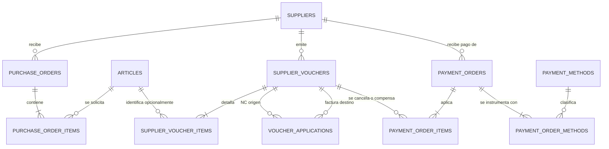

# Sprint Backlog 2 - Supermercados La Linda

**Sprint 2** · 29/08/2026 al 12/09/2026 · equipo de 6 personas
**Compromiso provisorio: 39 story points** (capacidad de referencia: 30 a 40 SP).

> Este documento referencia los ítems por ID. Los criterios de aceptación viven únicamente en
> `product-backlog.md`. El alcance fue reformulado el 2026-09-06 a partir de las correcciones del
> profesor sobre órdenes de compra, comprobantes de proveedor y el modelo de gastos.

## Objetivo del sprint

Que La Linda pueda emitir órdenes de compra, registrar con detalle los comprobantes recibidos de
proveedores y cancelar la deuda resultante mediante órdenes de pago trazables, inmutables, con
múltiples medios de pago y documentación propia en PDF.

Al cierre del sprint debe existir este recorrido completo:

```text
Orden de compra emitida por La Linda
    → comprobante recibido del proveedor con todos sus renglones
    → deuda ajustada por NC y ND
    → orden de pago emitida por La Linda
```

El sprint no calcula impuestos de compras, no genera PDFs de comprobantes externos y no actualiza
stock ni costos a partir de esos comprobantes.

## Decisiones confirmadas

1. Una orden de pago puede distribuirse entre varios medios de pago.
2. La orden de pago genera un PDF emitido por La Linda.
3. Las anulaciones cambian el estado y conservan cabeceras, detalles, imputaciones y medios.
4. La numeración de las órdenes de pago es global, correlativa y no reutilizable.
5. Facturas, notas de crédito y notas de débito registran todos los artículos que figuran en el
   documento recibido.
6. Los impuestos no se calculan ni se desagregan: el importe total se transcribe del comprobante.
7. La Linda no genera un PDF de la factura, NC o ND del proveedor; ofrece una vista de detalle de
   solo lectura.
8. No existe una pantalla independiente de reimputación de notas.

## Qué pidió el Product Owner y cómo se cubre

| # | Pedido corregido | Se cubre con | Decisión de alcance |
|---:|---|---|---|
| 1 | Emitir una OC con proveedor, artículos, cantidades, precios y total | `HU-033` | Incluida; sin circuito de cotización ni aprobación multinivel |
| 2 | Listar, filtrar, consultar e imprimir la OC | `HU-033` | Incluido en la misma rodaja vertical |
| 3 | Registrar factura, NC y ND con todos sus renglones | `HU-036` | Incluido; se admite artículo o concepto financiero |
| 4 | Tomar el total informado sin calcular IVA ni percepciones | `HU-036` | El total del documento es la cifra autoritativa |
| 5 | Consultar el comprobante sin inventar un PDF propio | `HU-036` | Listado y detalle web de solo lectura |
| 6 | NC asociada al cargar o libre para compensar en una OP | `HU-054` + `HU-027` | Modelo mixto, sin pantalla de reimputación |
| 7 | ND como aumento independiente de la deuda | `HU-054` + `HU-027` | Se cancela en una OP igual que una factura |
| 8 | Una OP cancela varios comprobantes y acepta varios medios | `HU-027` + `HU-052` | Facturas + ND − NC; medios totalizan el neto |
| 9 | Documento propio de OP con numeración global | `HU-027` | PDF de La Linda; número único y no reutilizable |
| 10 | No editar ni borrar operaciones confirmadas | `HU-036` + `HU-027` | Anulación por estado, con motivo y auditoría |

## Ítems comprometidos

| # | ID | Título | SP | Estado | Depende de |
|---:|---|---|---:|---|---|
| 1 | HU-013 | Administrar proveedores | 5 | Pendiente | nada |
| 2 | HU-052 | Administrar medios de pago | 2 | Pendiente | nada |
| 3 | HU-033 | Emitir y consultar órdenes de compra | 8 | Pendiente | HU-013, HU-005 |
| 4 | HU-036 | Registrar y consultar comprobantes de proveedor con detalle | 8 | Pendiente | HU-013, HU-008 |
| 5 | HU-054 | Gestionar notas de crédito y débito del proveedor | 3 | Pendiente | HU-036 |
| 6 | HU-027 | Emitir y anular una orden de pago a proveedor | 13 | Pendiente | HU-036, HU-054, HU-052 |
| | | **Total comprometido** | **39** | | |

No se incorpora alcance opcional. `HU-055` y `HU-021` vuelven al Product Backlog sin asignación al
Sprint 2 para proteger el circuito obligatorio corregido.

## Historias absorbidas

`HU-034`, `HU-035` y `HU-024` no se eliminan del Product Backlog, pero dejan de desarrollarse de
forma independiente. `HU-033` absorbe el detalle, el cálculo del total, la emisión, el listado, la
consulta y el PDF de la orden de compra.

Esta reunificación evita entregar por separado una cabecera o un cálculo que todavía no permitan
emitir un documento utilizable.

## Orden de ataque

```text
Primera etapa, en paralelo
├── HU-013  proveedores
└── HU-052  catálogo de medios de pago

Segunda etapa, en paralelo
├── HU-033  orden de compra completa
└── HU-036  comprobantes y detalle de artículos

Tercera etapa
└── HU-054  comportamiento de NC y ND

Cuarta etapa
└── HU-027  orden de pago, múltiples medios, PDF y anulación
```

- `HU-033` y `HU-036` pueden avanzar en paralelo porque solo comparten maestros ya existentes.
- El detalle del comprobante no se imputa a la OC durante este sprint; esa conciliación sigue en
  `HU-037`.
- `HU-027` comienza por el dominio y la transacción atómica antes de construir el formulario o el
  PDF.
- La persona que cierre `HU-052` se suma a `HU-027`, que concentra el mayor riesgo.

## Desglose en tareas

Stack: Laravel + Inertia.js + React sobre PostgreSQL, con SQLite en desarrollo y tests. La lógica
de negocio vive en `app/Actions/Purchasing` y las salidas tipadas en `app/Data/Purchasing`.

### HU-013 - Administrar proveedores (5 SP)

- [ ] Alta, modificación, consulta y cambio de estado de proveedores
- [ ] CUIT único y validado; datos comerciales y bancarios
- [ ] Filtros por razón social, CUIT, rubro y estado
- [ ] Impedir la eliminación física cuando tenga documentos asociados
- [ ] Datos de demostración y pruebas de las reglas de negocio

### HU-052 - Administrar medios de pago (2 SP)

- [ ] Catálogo de medios con nombre único y estado activo
- [ ] Impedir la baja de un medio utilizado en una operación
- [ ] Permitir que una misma operación use varios medios activos
- [ ] Mantener los datos transaccionales del cheque o transferencia fuera del catálogo
- [ ] Datos de demostración: efectivo, transferencia y cheque

### HU-033 - Emitir y consultar órdenes de compra (8 SP)

- [ ] Cabecera de OC: número, proveedor, depósito, condición de pago, fechas, observaciones y estado
- [ ] Detalle con artículo, cantidad, precio unitario pactado y subtotal
- [ ] Total automático como suma de subtotales, sin cálculo impositivo
- [ ] Estados mínimos: `borrador`, `emitida`, `cancelada`
- [ ] Permitir edición solo en borrador; emisión y cancelación sin efecto sobre stock
- [ ] Numeración única de la OC
- [ ] Listado con filtros por proveedor, estado, depósito y fechas
- [ ] Vista de detalle de solo lectura para órdenes emitidas
- [ ] PDF con identificación de La Linda y todo el contenido de la orden
- [ ] Pruebas de emisión, total, inmutabilidad, filtros, cancelación y PDF

### HU-036 - Registrar y consultar comprobantes con detalle (8 SP)

- [ ] Cabecera de `supplier_vouchers`: proveedor, tipo, letra, punto de venta, número, fechas,
      importe total, observaciones y estado
- [ ] Eliminar del alcance `net_amount`, `vat_amount` y `other_taxes_amount`
- [ ] Identidad fiscal única por proveedor + tipo + letra + punto de venta + número
- [ ] Crear detalle con posición, artículo opcional, descripción original, cantidad, unidad,
      precio unitario e importe de renglón
- [ ] Exigir que cada artículo del documento tenga su renglón; admitir renglones de concepto para
      cargos, descuentos o ajustes sin artículo del catálogo
- [ ] Conservar una copia de descripción y unidad para que el documento histórico no cambie cuando
      cambie el catálogo
- [ ] No exigir igualdad entre suma de renglones y total del documento; mostrar la diferencia como
      control informativo sin clasificarla como impuesto
- [ ] Factura y ND nacen pendientes; NC nace disponible para `HU-054`
- [ ] Saldo y estado derivados, nunca ingresados manualmente
- [ ] Listado con filtros y marca de vencimiento
- [ ] Vista de detalle de solo lectura con todos los renglones
- [ ] Ausencia de rutas de edición, eliminación y PDF para el comprobante externo
- [ ] Anulación con motivo, usuario y fecha; cabecera y renglones se conservan
- [ ] Pruebas de validación, detalle, inmutabilidad, consulta y anulación

### HU-054 - Gestionar notas de crédito y débito (3 SP)

- [ ] Al cargar una NC, permitir asociarla opcionalmente a una factura del mismo proveedor
- [ ] Validar saldo de factura e importe disponible de la NC
- [ ] Reducir inmediatamente el saldo de la factura por el importe asociado
- [ ] Mantener disponible cualquier parte no asociada de la NC
- [ ] Dejar una NC libre disponible para compensarla dentro de una OP
- [ ] Tratar la ND como obligación independiente con saldo propio
- [ ] No crear una pantalla de reimputación
- [ ] Registrar usuario y fecha de cada asociación sin permitir edición o borrado
- [ ] Pruebas de NC asociada, NC libre, remanente y ND pendiente

### HU-027 - Emitir y anular una orden de pago (13 SP)

- [ ] Cabecera con proveedor, número global, fecha, estado, observaciones y usuario
- [ ] Numeración global, correlativa, automática, única y no reutilizable
- [ ] Selección de facturas y ND pendientes y NC disponibles del mismo proveedor
- [ ] Importe aplicado por comprobante, con pagos totales y parciales
- [ ] Total neto automático: facturas + ND − NC
- [ ] Rechazar aplicaciones superiores al saldo o importe disponible
- [ ] Agregar uno o varios medios del catálogo, cada uno con su importe
- [ ] Validar que la suma de medios coincida con el total neto
- [ ] Datos específicos según medio: referencia, cuenta origen, número de operación o cheque y fecha
- [ ] Confirmación atómica con bloqueo de saldos para evitar doble imputación concurrente
- [ ] Actualización derivada de saldos y estados de todos los comprobantes afectados
- [ ] PDF de OP emitido por La Linda con comprobantes, aplicaciones, medios, total y estado
- [ ] Anulación con motivo, usuario y fecha, sin borrar cabecera, imputaciones ni medios
- [ ] Al anular, excluir los efectos de la OP y restituir los saldos derivados
- [ ] Exigir anular primero la OP antes de anular un comprobante incluido en ella
- [ ] Pruebas de varios comprobantes, varios medios, concurrencia, PDF e inversión por anulación

## Diseño de datos (DER)

La fuente de verdad del esquema implementado son las migraciones. Este DER documenta el modelo
objetivo corregido. Las migraciones ya existentes que todavía representen impuestos desagregados,
NC/ND N:N obligatorias o un único medio por OP deben adaptarse antes de considerar terminadas las
historias correspondientes.

Los importes usan `decimal(12,2)` y las cantidades de artículos `decimal(12,3)`. Los saldos se
derivan de las operaciones vigentes; no se mantienen como columnas editables.



### `purchase_orders` - HU-033

| Columna | Tipo | Regla |
|---|---|---|
| id | bigint PK | |
| supplier_id | FK → suppliers | proveedor activo |
| warehouse_id | FK → warehouses | depósito activo |
| order_number | varchar | único; no reutilizable |
| payment_terms | varchar/text | nullable |
| issue_date | date | obligatoria |
| expected_delivery_date | date | nullable; no anterior a emisión |
| total_amount | decimal(12,2) | suma de renglones |
| status | varchar | `borrador`, `emitida`, `cancelada` |
| notes | text | nullable |
| created_at / updated_at | timestamp | |

### `purchase_order_items` - HU-033

| Columna | Tipo | Regla |
|---|---|---|
| id | bigint PK | |
| purchase_order_id | FK → purchase_orders | |
| article_id | FK → articles | obligatorio |
| quantity | decimal(12,3) | mayor a cero |
| unit_price | decimal(12,2) | mayor a cero |
| line_total | decimal(12,2) | cantidad × precio unitario |

Un artículo aparece una sola vez por OC. La emisión vuelve inmutables la cabecera y el detalle.

### `supplier_vouchers` - HU-036

| Columna | Tipo | Regla |
|---|---|---|
| id | bigint PK | |
| supplier_id | FK → suppliers | proveedor activo |
| type | varchar | `factura`, `nota_credito`, `nota_debito` |
| letter | varchar(1) | `A`, `B`, `C`, `M` |
| point_of_sale | varchar(4) | conserva ceros iniciales |
| number | varchar(8) | conserva ceros iniciales |
| issue_date | date | no futura |
| due_date | date | nullable; no anterior a emisión |
| total_amount | decimal(12,2) | transcripto; mayor a cero |
| status | varchar | derivado según tipo, saldo y anulación |
| notes | text | nullable |
| annulled_at | timestamp | nullable |
| annulled_by | FK → users | nullable |
| annulment_reason | text | nullable; obligatorio al anular |
| created_at / updated_at | timestamp | no habilitan edición funcional |

No se almacenan neto, IVA ni percepciones. La identidad fiscal es única por proveedor, tipo,
letra, punto de venta y número.

### `supplier_voucher_items` - HU-036

| Columna | Tipo | Regla |
|---|---|---|
| id | bigint PK | |
| supplier_voucher_id | FK → supplier_vouchers | |
| position | integer | orden original del documento |
| article_id | FK → articles | nullable solo para conceptos |
| description | varchar/text | copia de la descripción original |
| quantity | decimal(12,3) | mayor a cero |
| unit_of_measure | varchar | copia histórica |
| unit_price | decimal(12,2) | mayor a cero |
| line_total | decimal(12,2) | mayor a cero; transcripto |

La suma de `line_total` es informativa y puede diferir de `supplier_vouchers.total_amount` porque
los impuestos no se desagregan. Esa diferencia no bloquea el alta.

### `voucher_applications` - HU-054

Registra únicamente la asociación directa de una NC a una factura durante el alta.

| Columna | Tipo | Regla |
|---|---|---|
| id | bigint PK | |
| source_voucher_id | FK → supplier_vouchers | debe ser NC |
| target_voucher_id | FK → supplier_vouchers | debe ser factura del mismo proveedor |
| amount | decimal(12,2) | mayor a cero y dentro de ambos saldos |
| user_id | FK → users | responsable |
| created_at | timestamp | inmutable |

Las ND no usan esta tabla. Una NC libre o su remanente se compensa en `payment_order_items`.

### `payment_orders` - HU-027

| Columna | Tipo | Regla |
|---|---|---|
| id | bigint PK | |
| supplier_id | FK → suppliers | |
| order_number | varchar | `UNIQUE` global, automático y no reutilizable |
| date | date | |
| total_amount | decimal(12,2) | facturas + ND − NC; mayor a cero |
| status | varchar | `emitida`, `anulada` |
| notes | text | nullable |
| user_id | FK → users | emisor |
| annulled_at | timestamp | nullable |
| annulled_by | FK → users | nullable |
| annulment_reason | text | nullable; obligatorio al anular |
| created_at | timestamp | sin edición funcional |

`payment_method_id` no pertenece a esta cabecera porque la relación es uno a muchos.

### `payment_order_items` - HU-027

| Columna | Tipo | Regla |
|---|---|---|
| id | bigint PK | |
| payment_order_id | FK → payment_orders | |
| supplier_voucher_id | FK → supplier_vouchers | factura, ND o NC del proveedor |
| amount_applied | decimal(12,2) | siempre positivo |

El signo se deriva del tipo: factura y ND suman; NC resta. Un comprobante aparece una sola vez por
OP, pero puede participar en distintas órdenes hasta agotar su saldo o importe disponible.

### `payment_order_methods` - HU-027

| Columna | Tipo | Regla |
|---|---|---|
| id | bigint PK | |
| payment_order_id | FK → payment_orders | |
| payment_method_id | FK → payment_methods | medio activo |
| amount | decimal(12,2) | mayor a cero |
| reference | varchar | nullable |
| source_account | varchar | nullable; transferencia |
| transaction_number | varchar | nullable; transferencia |
| check_number | varchar | nullable; cheque |
| check_due_date | date | nullable; cheque |

La suma de `amount` debe coincidir con `payment_orders.total_amount`.

## Reglas de saldo y anulación

- Factura pendiente = total − pagos vigentes − NC directas vigentes.
- ND pendiente = total − pagos vigentes.
- NC disponible = total − asociaciones directas vigentes − compensaciones en OP vigentes.
- Total OP = aplicaciones a facturas + aplicaciones a ND − aplicaciones de NC.
- Suma de medios de la OP = total OP.
- Los importes se validan dentro de una transacción con bloqueo para impedir doble aplicación.
- Una operación anulada y sus relaciones permanecen guardadas, pero no participan de los cálculos.
- Para anular un comprobante incluido en una OP vigente, primero se anula la OP.
- Toda anulación registra motivo, usuario y fecha.
- Ningún número de OP anulado vuelve a utilizarse.

## Trabajo existente que debe adaptarse

El repositorio ya contiene una primera versión del modelo anterior. No se considera válida como
cierre de las historias hasta corregir, como mínimo:

- campos y validaciones de neto, IVA y otros tributos en comprobantes;
- ausencia del detalle de artículos de factura, NC y ND;
- imputación N:N obligatoria de NC y ND contra facturas;
- orden de pago limitada a facturas;
- un único `payment_method_id` en la cabecera de la OP;
- cálculo de saldo que no excluye operaciones anuladas.

La adaptación se realiza con migraciones seguras según el estado compartido de la base; no se
reescribe una migración ya ejecutada en otros entornos sin verificarlo primero.

## Puntos de refinamiento no bloqueantes

1. Definir el formato visible de la numeración de OC. La numeración de OP ya quedó confirmada como
   global; se recomienda una secuencia independiente `OP-000001`.
2. Confirmar si “cheque” necesita distinguir propiedad (`propio`/`tercero`) además de modalidad o
   vencimiento. El DER permite guardar la referencia y la fecha sin cerrar esa clasificación.
3. Definir si la unidad del renglón siempre se copia del artículo o puede transcribirse del
   comprobante cuando el proveedor usa otra presentación.

Estos puntos afinan datos o presentación; no cambian el flujo comprometido.

## Demostración de cierre

1. Registrar un proveedor y habilitar efectivo, transferencia y cheque.
2. Crear una OC con varios artículos y precios pactados; verificar total, emisión, listado y PDF.
3. Registrar una factura con todos sus renglones y un total diferente del subtotal de líneas;
   comprobar que se guarda sin calcular impuestos.
4. Abrir el detalle de la factura y comprobar que no existen edición, eliminación ni PDF.
5. Registrar una NC asociada a la factura y verificar que baja su saldo.
6. Registrar una NC libre y una ND con sus respectivos detalles.
7. Emitir una OP con dos facturas, la ND y la NC libre, usando efectivo y transferencia.
8. Verificar `facturas + ND − NC`, suma de medios, número global y PDF de la OP.
9. Anular la OP con motivo y verificar que las filas siguen visibles y los saldos se restituyen.
10. Volver a emitir una OP y comprobar que el número anulado no se reutiliza.
11. Mostrar el DER actualizado.

## Fuera del sprint

| Ítem | Motivo |
|---|---|
| HU-034, HU-035 y HU-024 | Absorbidas por HU-033; no se implementan por separado |
| HU-037 | La conciliación comprobante ↔ OC no hace falta para emitir ni registrar ambos documentos |
| HU-038 | Actualización de costos y cierre por recepción dependen de HU-037 |
| HU-026 | El ingreso de stock desde compras pertenece al circuito de recepción |
| HU-055 | El listado gerencial de egresos se posterga para proteger el flujo transaccional corregido |
| HU-028 | La cuenta corriente consolidada se construye después del motor de pagos |
| HU-021 y HU-022 | Clientes y listas de precios no pertenecen al objetivo corregido del sprint |
| HU-019 | Transferencias entre depósitos no pertenecen al modelo de gastos |
| HU-007 | Los impuestos de compras no se calculan ni se desagregan en este sprint |

## Riesgos

- **Compromiso al límite:** 39 SP sobre una capacidad de referencia de 30 a 40. No se agrega alcance
  opcional y cualquier desvío se conversa con el PO; no se recorta silenciosamente una regla
  contable.
- **HU-027 concentra 13 SP:** varios comprobantes, varios medios, numeración, PDF y anulación deben
  confirmarse de forma atómica. El equipo debe trabajar sobre ella en conjunto.
- **Reproceso técnico:** parte del esquema existente implementa decisiones ahora corregidas. El
  costo de adaptación debe considerarse trabajo real del sprint.
- **Total versus renglones:** la diferencia es esperable si el proveedor muestra importes de línea
  sin impuestos. No debe reintroducirse un cálculo impositivo para forzar igualdad.
- **Inmutabilidad:** no alcanza con ocultar botones; el servidor debe rechazar actualización y
  eliminación de documentos confirmados.
- **Anulación:** todas las consultas de saldo deben excluir operaciones anuladas de forma uniforme,
  sin borrar sus relaciones.

## Definition of Done provisoria

Una historia se considera terminada cuando cumple:

- [ ] Criterios de aceptación verificados contra `product-backlog.md`
- [ ] Validaciones aplicadas en el servidor, no solo en la interfaz
- [ ] Writes con reglas de negocio encapsulados en Actions y cubiertos por tests
- [ ] Operaciones monetarias ejecutadas de forma atómica y sin pérdida de precisión
- [ ] Ausencia de rutas de edición o borrado para documentos confirmados
- [ ] Entidades nuevas o modificadas reflejadas en el DER
- [ ] Código integrado y desplegado en Laravel Cloud
- [ ] `composer run ci:check` en verde
- [ ] Capturas de pantalla y PDFs propios preparados para la Sprint Review

## Cómo se genera el Excel del entregable

El Excel se deriva en un solo sentido desde este documento y no se edita manualmente.

- Las filas son los seis ítems de “Ítems comprometidos”, en ese orden.
- No hay fila de alcance opcional.
- `HU-034`, `HU-035`, `HU-024`, `HU-055` y `HU-021` no aparecen como compromiso del Sprint 2.
- Los criterios de aceptación se obtienen de `product-backlog.md`.
