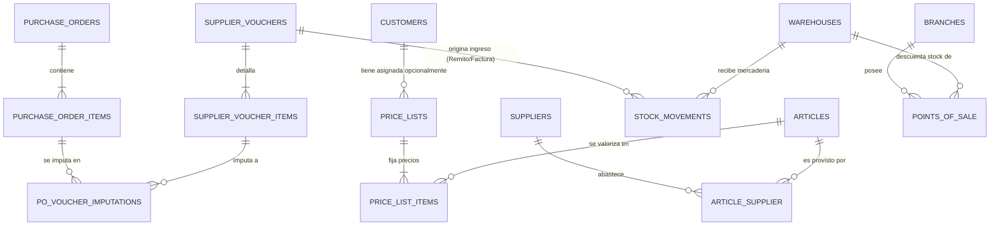

# Sprint Backlog 3 - Supermercados La Linda

**Sprint 3** · 12/09/2026 al 26/09/2026 · equipo de 6 personas  
**Compromiso: 59 story points** (capacidad ampliada: meta de al menos 55 SP para aceleración del desarrollo).

> Este documento referencia los ítems por ID. Los criterios de aceptación viven en `product-backlog.md`
> y se desglosan aquí con el detalle técnico y de arquitectura para su implementación operativa en el sprint.

---

## Objetivo del sprint

1. **Cerrar al 100% el módulo de Compras**: Completar la conciliación de órdenes de compra contra comprobantes (`HU-037`), la actualización automática de costos y cierre de órdenes (`HU-038`), el ingreso automático e inmutable de existencias a partir de comprobantes recibidos incorporando el tipo documental **Remito** (`HU-026`), y las herramientas de gestión y control financiero (cuenta corriente de proveedores `HU-028` y listado gerencial de pagos y egresos `HU-055`).
2. **Establecer el maestro de Clientes y Puntos de Venta**: Administrar el padrón de clientes con sus condiciones fiscales y el cliente por defecto Consumidor Final (`HU-021`), y reconectar/habilitar los puntos de venta vinculados a depósitos (`HU-051`).
3. **Construir el motor transversal de Precios**: Crear las listas de precios por canal (`HU-011`), permitir la definición de precios de artículos por lista (`HU-012`), asignar listas diferenciadas a clientes (`HU-022`) y construir el servicio de resolución automática de precios con cascada de precedencias (`HU-056`), dejando la base lista para el circuito de ventas del Sprint 4.

---

## Decisiones confirmadas del sprint

1. **Nuevo tipo de comprobante Remito (`SupplierVoucherType::Remito`)**:
   - Incorporado a `supplier_vouchers` para documentar traslados físicos de mercadería.
   - **No genera deuda monetaria** (`createsPayableBalance() === false`), por lo que no aparece como comprobante pagable en la emisión de Órdenes de Pago (`HU-027`).
   - Dispara la generación automática del movimiento de inventario positivo en `HU-026`.
2. **Imputación de comprobantes a Órdenes de Compra (HU-037)**:
   - La imputación a una o varias OC es **opcional** en el comprobante (se admiten facturas o remitos libres de gastos o compras directas sin OC).
   - Relación N:N: Un comprobante puede imputar renglones de varias OCs del mismo proveedor en estado `emitida`; una OC puede recibir múltiples entregas parciales.
   - La cantidad imputada a la orden salda el pendiente de cada renglón de la OC hasta cubrirlo (sin sobrepasarlo para preservar el presupuesto de la orden).
   - **Manejo de excedentes (pesables / carnicería):** Si el proveedor envía mercadería de más y recepción la acepta (ej. kilos adicionales en medias reses), el sobrante se registra explícitamente como excedente aceptado (`quantity_excess`). Tanto lo imputado a la OC como el excedente ingresan en su totalidad al stock físico real y se liquidan en el comprobante fiscal a pagar.
3. **Stock inmutable y anulación inversa (HU-026)**:
   - El movimiento de stock de ingreso se genera automáticamente al confirmar el comprobante de recepción (Remito o Factura que acompaña mercadería).
   - Los movimientos de stock son inmutables. Si un comprobante se anula, se genera automáticamente un movimiento inverso compensatorio de egreso con auditoría; nunca se borra el registro histórico original.
4. **Actualización de costo y cierre de OC (HU-038)**:
   - Solo los comprobantes valorizados (Facturas) con precio unitario $> 0$ actualizan el `last_cost` en la relación artículo-proveedor (`article_supplier`).
   - Cuando todos los renglones de una OC tienen saldo pendiente igual a cero, la OC pasa automáticamente a estado `cumplida`.
5. **Cliente genérico inmutable (HU-021)**:
   - Se crea vía seeder el cliente "Consumidor Final" (identificador fijo, condición fiscal Consumidor Final, no eliminable ni editable en su condición base).
6. **Inclusión obligatoria de HU-012 para sostener Precios**:
   - `HU-011` crea cabeceras y vigencias; `HU-012` carga los precios de los artículos en `price_list_items`. Sin `HU-012`, `HU-022` y `HU-056` carecerían de datos reales sobre los cuales operar.
7. **Resolución de precios con precedencia estricta (HU-056)**:
   - Cascada: 1) Lista particular asignada al cliente $\rightarrow$ 2) Lista vigente del canal (`mostrador` / `online`) $\rightarrow$ 3) Lista `general` vigente base.

---

## Qué pidió el Product Owner y cómo se cubre

| # | Pedido / Necesidad | Se cubre con | Decisión de alcance |
|---:|---|---|---|
| 1 | Asociar qué proveedores abastecen qué artículos y a qué costo | `HU-015` | Relación N:N, código propio del proveedor y costo base |
| 2 | Saber qué pedidos cubre una factura o remito y qué queda pendiente | `HU-037` | Imputación N:N a nivel renglón con control estricto de pendientes |
| 3 | Actualizar el costo del artículo automáticamente y cerrar la orden | `HU-038` | Actualiza `article_supplier.last_cost` y pasa la OC a `cumplida` |
| 4 | Ingresar stock al recibir la mercadería con Remito | `HU-026` | Tipo `remito` sin deuda; genera `StockMovement` de ingreso |
| 5 | Conocer la deuda consolidada y comprobantes vencidos de proveedores | `HU-028` | Saldo derivado en tiempo real, días de mora y exportación |
| 6 | Ver cuánto dinero se pagó en un período y con qué medios | `HU-055` | Reporte de egresos reales del período con filtros y exportación |
| 7 | Registrar clientes con CUIT y condición fiscal | `HU-021` | Validación AFIP/ARCA de CUIT y cliente default Consumidor Final |
| 8 | Habilitar los puntos de venta para ventas de mostrador | `HU-051` | Reconexión en menú, validación por sucursal y depósito asignado |
| 9 | Crear listas de precios diferenciadas por canal y vigencia | `HU-011` | Listas de canal (mostrador, web, general) con control de no solapamiento, más listas particulares para precios preferenciales |
| 10 | Fijar los precios de venta de cada artículo en cada lista | `HU-012` | Carga masiva/ágil de precios unitarios mayores a cero |
| 11 | Asignar precios preferenciales a clientes particulares | `HU-022` | Vínculo de lista de precios a cliente opcional |
| 12 | Resolver automáticamente el precio a cobrar en mostrador y web | `HU-056` | Action transversal `ResolveArticlePrice` con cascada de precedencias |

---

## Ítems comprometidos (59 SP)

| # | ID | Título | SP | Estado | Depende de |
|---:|---|---|---:|---|---|
| 1 | **HU-015** | Asociar artículos a sus proveedores | 5 | Pendiente | HU-013 |
| 2 | **HU-037** | Imputar el comprobante a una o varias órdenes de compra | 5 | Pendiente | HU-036, HU-033 |
| 3 | **HU-038** | Actualizar el último costo y cerrar la orden cubierta | 3 | Pendiente | HU-037, HU-015 |
| 4 | **HU-026** | Ingresar el stock a partir del comprobante recibido (con Remito) | 8 | Pendiente | HU-037, HU-017 |
| 5 | **HU-028** | Consultar el saldo de cuenta corriente de un proveedor | 3 | Pendiente | HU-027 |
| 6 | **HU-055** | Consultar el listado de pagos y egresos del período | 5 | Pendiente | HU-027, HU-036 |
| 7 | **HU-021** | Administrar clientes | 5 | Pendiente | nada |
| 8 | **HU-051** | Administrar puntos de venta (Reconectar) | 2 | Pendiente | HU-005 |
| 9 | **HU-011** | Administrar listas de precios | 5 | Pendiente | nada |
| 10 | **HU-012** | Definir el precio de venta de los artículos en una lista | 8 | Pendiente | HU-011 |
| 11 | **HU-022** | Asignar una lista de precios a un cliente | 2 | Pendiente | HU-021, HU-011 |
| 12 | **HU-056** | Resolver el precio de venta según el cliente y el canal | 8 | Pendiente | HU-022, HU-012 |
| | | **Total comprometido** | **59** | | |

---

## Orden de ataque y paralelización (Equipo de 6 personas)

Para abordar los 59 SP con máxima eficiencia y sin colisiones de código, el equipo trabaja en tres frentes paralelos (duplas):

```text
┌──────────────────────────────────────────────────────────────────────────┐
│ FRENTE 1 (Dupla A): Circuito Físico de Compras e Inventario (21 SP)      │
│ • Etapa 1: HU-015 (Catálogo N:N y código proveedor)                      │
│ • Etapa 2: HU-037 (Imputación comprobante ↔ OC a nivel renglón)          │
│ • Etapa 3: HU-026 (Tipo Remito + creación de StockMovement automático)   │
│ • Etapa 4: HU-038 (Actualización de costos automáticos y cierre de OC)   │
└────────────────────────────────────┬─────────────────────────────────────┘
                                     │
┌────────────────────────────────────┴─────────────────────────────────────┐
│ FRENTE 2 (Dupla B): Finanzas de Compras + Clientes y POS (15 SP)         │
│ • Etapa 1: HU-051 (Reconectar puntos de venta en menú y layout)          │
│ • Etapa 2: HU-021 (Maestro de clientes y Consumidor Final)               │
│ • Etapa 3: HU-028 (Cuenta corriente y antigüedad de deuda proveedor)     │
│ • Etapa 4: HU-055 (Listado gerencial de egresos y exportación)           │
└────────────────────────────────────┬─────────────────────────────────────┘
                                     │
┌────────────────────────────────────┴─────────────────────────────────────┐
│ FRENTE 3 (Dupla C): Motor Transversal de Precios (23 SP)                 │
│ • Etapa 1: HU-011 (Cabeceras de listas de precios y vigencias)           │
│ • Etapa 2: HU-012 (Carga de precios de artículos en listas)              │
│ • Etapa 3: HU-022 (Asignación de lista preferencial a cliente)           │
│ • Etapa 4: HU-056 (Algoritmo y Action ResolveArticlePrice en cascada)   │
└──────────────────────────────────────────────────────────────────────────┘
```

---

## Desglose en tareas por Historia de Usuario

Stack: Laravel 12 + Inertia.js v3 + React sobre PostgreSQL (SQLite en tests/dev).  
Lógica de negocio encapsulada en `app/Actions/{Module}`, respuestas tipadas en `app/Data/{Module}` y formularios validados vía Form Requests.

### HU-015 — Asociar artículos a sus proveedores (5 SP)
- [ ] Crear migración y modelo pivote `article_supplier` con `supplier_article_code` y `last_cost`.
- [ ] Validar unicidad de `(article_id, supplier_id)` y unicidad de `supplier_article_code` dentro de cada proveedor.
- [ ] Validar `last_cost > 0` cuando se informa.
- [ ] Crear Actions `AttachSupplierToArticle`, `UpdateArticleSupplier` y `DetachSupplierFromArticle`.
- [ ] Implementar gestión bidireccional: pestaña en detalle de Artículo y pestaña en detalle de Proveedor.
- [ ] Tests de Pest para unicidad, validación de costo y consulta bidireccional.

### HU-037 — Imputar comprobante a órdenes de compra (5 SP)
- [ ] Crear migración `purchase_order_voucher_imputations` con claves foráneas a `purchase_order_items` y `supplier_voucher_items`.
- [ ] En formulario de carga de comprobante, agregar selector opcional de OCs en estado `emitida` del proveedor seleccionado.
- [ ] Cargar/sugerir renglones de artículos con cantidades pendientes de las OCs imputadas.
- [ ] Validar que la cantidad recibida no supere la cantidad pendiente de cada renglón de la OC.
- [ ] Permitir comprobantes libres sin OC (imputación opcional).
- [ ] Mostrar en la consulta de OC las cantidades pedidas, recibidas acumuladas y pendientes.
- [ ] Tests de imputación N:N, rechazo por exceso de cantidad y comportamiento ante anulación.

### HU-038 — Actualizar último costo y cerrar orden cubierta (3 SP)
- [ ] Crear Action `UpdateLastPurchaseCost` que actualice `article_supplier.last_cost` al imputar facturas valorizadas con precio unitario.
- [ ] Crear Action `EvaluatePurchaseOrderFulfillment` que calcule el saldo pendiente de todas las líneas de la OC.
- [ ] Pasar automáticamente la OC a estado `cumplida` si todas sus líneas tienen pendiente cero.
- [ ] Mantener la OC en `emitida` si la cobertura es parcial.
- [ ] Si se anula un comprobante que cumplió la OC, retornar la OC a `emitida`.
- [ ] Tests de actualización de costos, transición de estados e inversión por anulación.

### HU-026 — Ingresar stock desde comprobante recibido con Remito (8 SP)
- [ ] Añadir valor `Remito = 'remito'` en `SupplierVoucherType` con `createsPayableBalance() => false`.
- [ ] Adaptar formulario de comprobantes para admitir tipo Remito (letras R/X, sin exigencia de total a pagar fiscal).
- [ ] Crear Action `CreateStockMovementFromVoucher`: genera un `StockMovement` positivo vinculado a `supplier_voucher_id` y al depósito de destino.
- [ ] Actualizar automáticamente las existencias en `stock_balances`.
- [ ] Garantizar generación única por comprobante (no duplicar stock si ya ingresó por remito previo).
- [ ] Inmutabilidad y anulación: al anular el remito/comprobante de ingreso, generar automáticamente un movimiento inverso compensatorio de egreso con auditoría.
- [ ] Enlace bidireccional: navegar entre el comprobante y el movimiento de stock en el historial.
- [ ] Tests de alta de remito, generación atómica de stock, exclusión de pagos y reversión por anulación.

### HU-028 — Consultar saldo de cuenta corriente de proveedor (3 SP)
- [ ] Crear Query/Action `GetSupplierAccountStatement` que calcule en tiempo real: Facturas + ND − Pagos en OP vigentes − NC directas/compensadas.
- [ ] Excluir de forma estricta comprobantes, remitos y órdenes de pago anuladas.
- [ ] Listar detalle de comprobantes impagos con fecha de emisión, fecha de vencimiento, importe original, saldo adeudado y antigüedad en días.
- [ ] Marcar visualmente comprobantes vencidos con badge de advertencia.
- [ ] Implementar exportación a CSV y Excel del estado de cuenta corriente.
- [ ] Tests unitarios y de integración de cálculo de saldo y filtros.

### HU-055 — Consultar listado de pagos y egresos del período (5 SP)
- [ ] Crear controlador y vista de solo lectura para egresos financieros.
- [ ] Filtros combinables: rango de fechas de emisión, proveedor, medio de pago y estado de la OP.
- [ ] Exponer totalizador sumando exclusivamente los pagos efectivos imputados en el período (excluyendo OPs anuladas y facturas impagas).
- [ ] Modal/detalle para inspeccionar qué comprobantes fueron saldados por cada pago.
- [ ] Implementar exportación a CSV y Excel del listado de egresos.
- [ ] Tests de filtros, totalizadores y exclusión de anulaciones.

### HU-021 — Administrar clientes (5 SP)
- [ ] Crear migración y modelo `customers` (tipo persona física/jurídica, razón social/nombre, CUIT/DNI, condición fiscal, contacto, estado).
- [ ] Implementar validación de CUIT con algoritmo módulo 11 para Responsables Inscriptos.
- [ ] Seeder con cliente por defecto "Consumidor Final" (inmutable, no eliminable).
- [ ] CRUD con bajas lógicas para clientes con operaciones vinculadas.
- [ ] Tests de validación de condición fiscal, CUIT y protección de Consumidor Final.

### HU-051 — Administrar puntos de venta (Reconectar) (2 SP)
- [ ] Descomentar import y entrada en `resources/js/components/app-sidebar.tsx`.
- [ ] Verificar validación de número único por sucursal y depósito obligatorio asignado.
- [ ] Asegurar que el depósito asignado pertenezca a la misma sucursal.
- [ ] Comprobar navegación y suite de tests de puntos de venta en verde.

### HU-011 — Administrar listas de precios (5 SP)
- [ ] Crear migración y modelo `price_lists` (nombre único, tipo: `canal` / `particular`, canal: `mostrador`, `online`, `general` —solo para tipo `canal`—, vigencia desde/hasta, estado).
- [ ] Validar que `valid_to >= valid_from` y que no haya dos listas **de canal** activas solapadas para el mismo canal; las `particular` pueden solaparse libremente.
- [ ] Garantizar que el canal `general` quede cubierto sin huecos desde hoy en adelante (seeder + validación sobre la cadena de listas generales activas).
- [ ] Vista con selector de tipo, canal condicional, cálculo de vigencia en tiempo real (`Vigente`, `Futura`, `Vencida`) y conteo de artículos con precio.
- [ ] Tests de solapamiento de vigencias, reactivación, sucesión de listas y protección de la cobertura general.

### HU-012 — Definir precio de venta de artículos en lista (8 SP)
- [x] Crear migración y modelo `price_list_items` (`price_list_id`, `article_id`, `price` con 2 decimales $> 0$).
- [x] Validar unicidad `UNIQUE(price_list_id, article_id)`.
- [x] Permitir fijar precios únicamente a artículos en estado `activo`.
- [x] Pantalla ágil para asignar/editar precios por lista con buscador rápido, **filtro por categoría** y filtro de artículos sin precio.
- [x] Permitir quitar el precio de un artículo de la lista.
- [x] Conectar el conteo `articles_with_price_count` que HU-011 dejó fijo en 0.
- [x] Permitir convivencia de precios distintos para un mismo artículo en listas distintas.
- [x] Tests de persistencia, unicidad y validación de precios $> 0$.

**Decisiones de alcance tomadas en la implementación:**
- La pantalla es una página de detalle (`pricing/price-lists/{price_list}`) con filtros y paginación
  del lado del servidor, no un diálogo: el catálogo no escala al filtrado en cliente de HU-011.
- El query base son **Artículos** con LEFT JOIN a `price_list_items`, no al revés: un artículo sin
  precio es la ausencia de fila, así que el filtro "sin precio" solo es alcanzable partiendo del
  catálogo.
- Un artículo desactivado *después* de tener precio conserva su fila (badge "Artículo inactivo",
  solo se puede quitar). Si no, el precio quedaría invisible y HU-056 lo seguiría resolviendo.
- Se permite cargar precios en listas vencidas, futuras e inactivas sin bloqueo de servidor:
  preparar una lista `futura` es el flujo de sucesión de canal que describe el glosario.
- "Carga masiva" se implementó como **carga ágil**: edición inline de varias filas y un guardado
  batch de lo modificado. La importación CSV y el aumento por porcentaje son HU-029, fuera del sprint.

**Pendiente de definición del PO (no bloquea HU-012):** si `price` es precio final con IVA incluido
o neto. No cambia el esquema, pero HU-041 (cálculo de IVA y totales) necesita la respuesta.

**Candidato a backlog:** "copiar precios desde otra lista". Sin eso, crear la lista sucesora de un
canal obliga a recargar todos los precios a mano.

### HU-022 — Asignar una lista de precios a un cliente (2 SP)
- [x] Agregar columna `price_list_id` (nullable, FK a `price_lists`) en `customers`.
- [x] Selector de listas en formulario de cliente (solo listas de tipo `particular`, activas y vigentes).
- [x] Reflejar la lista asignada en la ficha y tabla de clientes.
- [x] Tests de asignación, nulabilidad y persistencia.

### HU-056 — Resolver el precio de venta según cliente y canal (8 SP)
- [ ] Crear Action invocable `App\Actions\Pricing\ResolveArticlePrice`.
- [ ] Implementar cascada de resolución:
  1. Precio en lista asignada al cliente (si está activa y vigente).
  2. Precio en lista vigente del canal (`mostrador` o `online`).
  3. Precio en lista general vigente.
- [ ] Manejo de excepción/error claro si el artículo no tiene precio en ninguna lista aplicable.
- [ ] Endpoint / servicio interno para cotización rápida de líneas.
- [ ] Tests exhaustivos de Pest simulando todas las combinaciones de cliente, canal y listas base.

---

## Diseño de datos (DER Proyectado Sprint 3)



### `article_supplier` - HU-015 / HU-038
| Columna | Tipo | Reglas |
|---|---|---|
| id | bigint PK | |
| article_id | FK → articles | obligatorio |
| supplier_id | FK → suppliers | obligatorio |
| supplier_article_code | varchar | obligatorio; único por proveedor |
| last_cost | decimal(12,2) | nullable; mayor a cero; actualizado por HU-038 |
| notes | text | nullable |
| created_at / updated_at | timestamp | |
*Restricción:* `UNIQUE(article_id, supplier_id)`, `UNIQUE(supplier_id, supplier_article_code)`.

### `purchase_order_voucher_imputations` - HU-037
| Columna | Tipo | Reglas |
|---|---|---|
| id | bigint PK | |
| purchase_order_item_id | FK → purchase_order_items | obligatorio |
| supplier_voucher_item_id | FK → supplier_voucher_items | obligatorio |
| quantity_received | decimal(12,3) | mayor a cero; cantidad que salda la OC ($\le$ pendiente de la OC) |
| quantity_excess | decimal(12,3) | default 0; mayor o igual a cero; excedente aceptado en recepción |
| created_at | timestamp | inmutable |

### `supplier_vouchers` (Adaptación HU-026 / Remito)
- Se agrega el valor `'remito'` a la columna `type`.
- En caso de tipo `remito`, `total_amount` no genera saldo a pagar fiscal (`createsPayableBalance() === false`).
- Columna `warehouse_id` (FK nullable a `warehouses`) para indicar depósito de descarga física en remitos libres.

### `customers` - HU-021 / HU-022
| Columna | Tipo | Reglas |
|---|---|---|
| id | bigint PK | |
| person_type | varchar | `fisica`, `juridica` |
| name | varchar | razón social o nombre completo |
| id_type | varchar | `cuit`, `dni`, `sin_identificar` |
| id_number | varchar | nullable para consumidor final; CUIT validado |
| tax_condition | varchar | `responsable_inscripto`, `monotributo`, `consumidor_final`, `exento` |
| price_list_id | FK → price_lists | nullable (HU-022); lista preferencial activa |
| address | varchar | nullable |
| phone | varchar | nullable |
| email | varchar | nullable; formato email |
| is_active | boolean | default true |
| is_default | boolean | default false; true para "Consumidor Final" protegido |
| created_at / updated_at | timestamp | |

### `price_lists` - HU-011
| Columna | Tipo | Reglas |
|---|---|---|
| id | bigint PK | |
| name | varchar | único |
| name_normalized | varchar | único; comparación sin mayúsculas ni espacios externos |
| scope | varchar | `canal` (precio base de un canal de venta) o `particular` (precio preferencial por cliente) |
| channel | varchar | nullable; `mostrador`, `online`, `general`. Obligatorio si `scope = canal`, siempre null si `scope = particular` |
| valid_from | date | obligatorio |
| valid_to | date | nullable; $\ge$ valid_from |
| is_active | boolean | default true |
| description | text | nullable |
| created_at / updated_at | timestamp | |
*Restricciones de negocio:* dos listas con `scope = canal`, activas y del mismo `channel`, no pueden tener periodos superpuestos. El `channel = general` no puede quedar descubierto desde la fecha actual en adelante.

### `price_list_items` - HU-012
| Columna | Tipo | Reglas |
|---|---|---|
| id | bigint PK | |
| price_list_id | FK → price_lists | obligatorio |
| article_id | FK → articles | artículo en estado activo |
| price | decimal(12,2) | mayor a cero |
| created_at / updated_at | timestamp | |
*Restricción:* `UNIQUE(price_list_id, article_id)`.

---

## Demostración de cierre del Sprint 3 (Sprint Review)

1. **Catálogo y Proveedor:** Asociar dos proveedores a un artículo con códigos y costos distintos.
2. **OC e Imputación:** Emitir una OC por 100 unidades; cargar un comprobante imputado por 60 unidades y comprobar que la OC muestra 60 recibidas y 40 pendientes.
3. **Remito y Stock:** Registrar un Remito por las 40 unidades restantes; verificar el ingreso automático a existencias (`stock_balances`) y que la OC pasa a `cumplida`.
4. **Costo Automático:** Comprobar que el `last_cost` del artículo se actualizó con el precio pactado.
5. **Cuentas y Pagos:** Consultar la cuenta corriente del proveedor con su saldo pendiente; emitir un listado de pagos y egresos del período exportándolo a Excel.
6. **Clientes:** Registrar un cliente Responsable Inscripto con CUIT validado y verificar la presencia del cliente protegido "Consumidor Final".
7. **Puntos de Venta:** Acceder a Puntos de Venta desde el menú reconectado y constatar su asignación a sucursal y depósito.
8. **Motor de Precios:** Cargar precios para un artículo en la Lista General (canal `general`, \$200), la Lista Mostrador (canal `mostrador`, \$180) y la Lista Mayorista (tipo `particular`, \$150), mostrando que la particular convive con las de canal sin que el sistema la rechace por superposición.
9. **Resolución de Precios:** Ejecutar simulación de venta comprobando que el cliente con la Lista Mayorista asignada toma \$150, la venta de mostrador anónima toma \$180 y un artículo sin precio de mostrador toma los \$200 de la lista general.

---

## Fuera del sprint

| Ítem | Motivo |
|---|---|
| `HU-039`, `HU-040`, `HU-041` | Apertura de venta de mostrador, lectura de código de barras y cálculo de totales/IVA corresponden al circuito de ventas de caja del Sprint 4. |
| `HU-042`, `HU-043` | Facturación fiscal y PDF de comprobante de venta corresponden al Sprint 4. |
| `HU-044`, `HU-045` | Anulación de venta y devoluciones parciales de clientes se construyen sobre la venta ya confirmada. |
| `HU-029`, `HU-030` | Aumento masivo de precios por porcentaje e historial de precios se incorporan como optimización posterior al motor comercial. |
| `HU-014` | Contactos secundarios de proveedores no bloquean las operaciones transaccionales. |

---

## Definition of Done

- [ ] Criterios de aceptación verificados contra `product-backlog.md`.
- [ ] Validaciones aplicadas en el servidor mediante Form Requests.
- [ ] Reglas de negocio y mutaciones encapsuladas en `app/Actions/{Module}`.
- [ ] Respuestas tipadas hacia el frontend mediante `app/Data/{Module}`.
- [ ] Cobertura de pruebas unitarias y de integración con Pest (`php artisan test --compact` en verde).
- [ ] Análisis estático PHPStan sin errores (`composer run types:check`).
- [ ] Código frontend y backend formateado (`vendor/bin/pint` y `npm run format:check` / `npm run lint:check`).
- [ ] Entidades reflejadas en migraciones y DER sincronizado.
