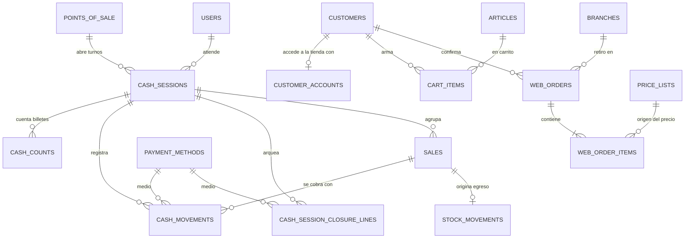

# Sprint Backlog 4 - Supermercados La Linda

**Sprint 4** · 27/09/2026 al 10/10/2026 · equipo de 6 personas
**Compromiso: 62 story points** (velocidad observada del equipo: 60 a 65 SP) más 12 SP de ítems
candidatos si sobra capacidad.

> Este documento referencia los ítems por ID. Los criterios de aceptación viven en
> `product-backlog.md`; se escribieron en este planning a partir de la reunión con el PO del
> 26/09/2026 (`revisión26sep_limpio.md`).
>
> **Revisión pendiente del Sprint 3:** el PO no llegó a revisarlo el 26/09 y lo revisa el
> **viernes 02/10/2026**. Los ajustes que surjan de esa revisión entran como trabajo no planificado
> de este sprint; por eso el compromiso queda en 62 y no en el techo de 65.

---

## Objetivo del sprint

1. **Operar una caja de punta a punta:** el cajero abre su turno declarando el fondo inicial
   billete por billete, vende escaneando artículos al precio de la lista vigente, cobra con uno o
   varios medios de pago, registra ingresos y egresos de dinero en el medio del turno y al final
   cierra con un arqueo discriminado por medio de pago (efectivo contado, cierre de lote del
   POSNET, billeteras virtuales) que le sirve para rendir. Toda venta y todo movimiento de dinero
   queda asociado al turno de caja en que ocurrió.
2. **Abrir la tienda online:** el cliente navega el catálogo publicado con los precios del canal
   online, se registra, arma su carrito y confirma el pedido. Sin calificaciones ni reseñas.

Al cierre del sprint debe existir este recorrido:

```text
Mostrador:  Abrir caja (fondo por denominación)
              → venta escaneando artículos (precio de lista vigente)
              → cobro con varios medios de pago → venta confirmada → egreso de stock
              → ingresos / egresos de caja durante el turno
              → cierre con arqueo por medio de pago (esperado vs. declarado)

Online:     Catálogo público (precio canal online)
              → registro / inicio de sesión del cliente
              → carrito persistente → confirmación del pedido
```

El sprint **no** emite factura fiscal ni su PDF (`HU-042`, `HU-043`), **no** cobra online con
Mercado Pago (`HU-050`) y **no** convierte el pedido web en venta (`EPIC-15`). Ver "Fuera del
sprint".

---

## Qué pidió el Product Owner y cómo se cubre

| # | Pedido del PO (26/09) | Se cubre con | Decisión de alcance |
|---:|---|---|---|
| 1 | El cajero abre la caja y carga el cambio inicial | `HU-057` (nueva) | Turno de caja por punto de venta con fondo inicial |
| 2 | Registrar la cantidad y denominación de billetes al abrir | `HU-057` (nueva) | Conteo por denominación; el fondo es la suma, no se tipea |
| 3 | La apertura genera un ID de caja y cada venta queda asociada a él | `HU-057`, `HU-039` (modificada) | No se puede abrir una venta sin turno de caja abierto; la venta guarda el turno |
| 4 | Escanear productos con el precio de la lista vigente | `HU-040`, `HU-041`, `HU-056` | Ya adelantado en el PR #56; se cierra con criterios aprobados |
| 5 | Cobrar en efectivo, tarjeta, POSNET y aplicaciones | `EPIC-04` (pasa a historia) | Cobro mixto con vuelto en efectivo; cada cobro es un movimiento de caja |
| 6 | Gastos, retiros y préstamos entre cajas como "movimiento de caja"; las ventas también son movimientos | `HU-058` (nueva), `HU-059` (nueva, candidata) | Entidad única `cash_movements` con tipo; la venta es un tipo más |
| 7 | Cierre y arqueo al final del turno, discriminado por medio de pago, con listado para rendir | `HU-060` (nueva) | Esperado vs. declarado por medio de pago, conteo de billetes al cerrar y número de lote del POSNET |
| 8 | E-commerce: interfaz optimizada para el cliente final, estilo Coto Digital / PedidosYa | `HU-046`, `EPIC-11`, `EPIC-13`, `HU-062` (nueva) | Catálogo público, cuenta de cliente, carrito y confirmación de pedido |
| 9 | Sin calificaciones, estrellas ni reseñas | — | Queda explícitamente fuera del alcance del producto |
| 10 | Foco en desktop; no se prueba en celular | — | Se diseña y se prueba en desktop. Los componentes ya son responsivos, pero no se invierte tiempo en mobile |

---

## Decisiones del planning

1. **Caja = punto de venta; turno de caja = sesión.** Una caja física es un punto de venta
   (`HU-051`, 1 a 1). Lo que el PO llamó "ID de movimiento de caja" es el **turno de caja**
   (`cash_sessions`): se crea al abrir y es el ID al que se asocian las ventas y los movimientos.
   Un punto de venta tiene a lo sumo un turno abierto, y un usuario también.
2. **Todo movimiento de dinero es un `cash_movement`** (modelo del PO: "vayan por esa entidad"):
   `apertura`, `venta`, `ingreso` y `egreso` en este sprint; `prestamo_salida` y
   `prestamo_entrada` los agrega `HU-059`. Un gasto o un retiro es un `egreso` con motivo
   obligatorio. Los movimientos son inmutables: un error se corrige con el movimiento contrario.
3. **Una venta cobrada con dos medios genera dos movimientos de tipo `venta`**, uno por medio. Así
   el arqueo por medio de pago es una suma de movimientos sin casos especiales.
4. **El efectivo registra lo que queda en la caja, no lo que entregó el cliente:** si paga $10.000
   una venta de $8.500, el movimiento es de $8.500 y el vuelto ($1.500) se guarda solo para
   mostrarlo en el comprobante.
5. **Medios de pago con clase.** `payment_methods` suma `kind` (`efectivo`, `tarjeta`,
   `billetera_virtual`, `transferencia`, `otro`). Solo `efectivo` admite vuelto y se arquea contando
   billetes; `tarjeta` pide número de lote del POSNET al cerrar.
6. **Estados de la venta:** `abierta` → `confirmada` (cuando el cobro cubre el total) o
   `descartada`. La venta confirmada es inmutable; su anulación es `HU-044`, fuera del sprint.
7. **El stock se descuenta al confirmar**, del depósito del punto de venta, con el tipo de sistema
   "Salida por Venta" que ya existe. Mismo criterio que `HU-017`: la existencia no puede quedar
   negativa (a confirmar con el PO, ver preguntas).
8. **Precio de lista = precio final con IVA incluido** (supuesto del PR #56, que el PO todavía no
   confirmó). Con eso el total es correcto sin discriminar IVA. La discriminación pasa a `HU-063`
   (nueva), que junto con la factura queda fuera del sprint.
9. **La cuenta del cliente online es una tabla aparte** (`customer_accounts`, con guard propio),
   no un `User`: los usuarios son personal interno. Registrarse crea el `Customer` como consumidor
   final y su cuenta.
10. **Mirar el catálogo no requiere sesión; agregar al carrito sí.** El carrito se guarda en la
    base asociado al cliente, así que se conserva entre visitas sin fusionar carritos de invitado.
11. **El carrito no guarda precios.** Muestra el precio resuelto en el momento por
    `ResolveArticlePrice` (canal `online`, cliente logueado). El precio se fija al confirmar el
    pedido, igual que la venta de mostrador lo fija al agregar la línea.
12. **El pedido confirmado es un `web_order`, no una `sale`.** Se convierte en venta con factura y
    egreso de stock cuando esté pagado (`EPIC-15`, fuera del sprint). En este sprint el pedido
    queda `pendiente` con retiro en sucursal; `HU-049` suma el envío y `HU-050` el pago.
13. **Reestimación de lo adelantado en el PR #56.** `HU-040` y `HU-041` se construyeron fuera del
    compromiso del Sprint 3. Entran a este sprint con la estimación del **trabajo restante** (2 SP
    cada una, antes 5) y no con la original, para no inflar la velocidad con trabajo ya hecho.
    `HU-039` mantiene sus 3 SP porque atarla al turno de caja cambia su comportamiento.

---

## Ítems comprometidos (62 SP)

| # | ID | Título | SP | Depende de |
|---:|---|---|---:|---|
| 1 | **HU-057** | Abrir la caja con el fondo inicial desglosado por denominación | 5 | HU-051, HU-052 |
| 2 | **HU-039** | Abrir una venta de mostrador dentro del turno de caja | 3 | HU-057, HU-021 |
| 3 | **HU-040** | Incorporar artículos a la venta por código de barras o búsqueda | 2 | HU-039 |
| 4 | **HU-041** | Calcular el precio y los totales de la venta | 2 | HU-040, HU-056 |
| 5 | **EPIC-04** | Cobrar la venta con uno o varios medios de pago | 8 | HU-041, HU-052, HU-057 |
| 6 | **EPIC-06** | Descontar el stock automáticamente al confirmar la venta | 5 | EPIC-04 |
| 7 | **HU-058** | Registrar ingresos y egresos de dinero en la caja | 3 | HU-057 |
| 8 | **HU-060** | Cerrar la caja con arqueo por medio de pago | 8 | EPIC-04, HU-058 |
| 9 | **HU-046** | Publicar el catálogo en la tienda online | 5 | HU-012, HU-056 |
| 10 | **EPIC-11** | Registrarse e iniciar sesión como cliente en la tienda online | 8 | HU-021 |
| 11 | **EPIC-13** | Gestionar el carrito de compras | 8 | HU-046, EPIC-11 |
| 12 | **HU-062** | Confirmar el pedido desde el carrito | 5 | EPIC-13 |
| | | **Total comprometido** | **62** | |

### Candidatos si sobra capacidad (en este orden)

| # | ID | Título | SP | Por qué queda afuera del compromiso |
|---:|---|---|---:|---|
| 1 | **HU-032** | Registrar la imagen de un artículo | 3 | La tienda funciona con un placeholder; es lo primero que se suma porque mejora mucho la demo |
| 2 | **HU-061** | Consultar los turnos de caja y su rendición | 3 | `HU-060` ya muestra la rendición del turno que se cierra; esto es el histórico para el Gerente |
| 3 | **HU-059** | Registrar un préstamo de dinero entre cajas | 3 | El PO lo mencionó como algo "probable"; un egreso y un ingreso manuales lo cubren mientras tanto |
| 4 | **HU-048** | Mostrar la disponibilidad online e impedir la compra sin stock | 3 | Sin esto se puede pedir algo sin stock; se resuelve al preparar el pedido |

---

## Orden de ataque y paralelización (3 duplas)

```text
┌──────────────────────────────────────────────────────────────────────────┐
│ DUPLA A: Caja (21 SP)                                                    │
│ • 1. HU-057  Turno de caja + conteo + cash_movements   ← bloquea a B     │
│ • 2. HU-046  Catálogo público de la tienda             ← bloquea a C     │
│ • 3. HU-058  Ingresos y egresos de caja                                  │
│ • 4. HU-060  Cierre y arqueo por medio de pago                           │
└──────────────────────────────────────────────────────────────────────────┘
┌──────────────────────────────────────────────────────────────────────────┐
│ DUPLA B: Venta de mostrador (20 SP)                                      │
│ • 1. HU-040 + HU-041  Cerrar criterios sobre lo del PR #56 (sin esperar) │
│ • 2. HU-039  Atar la venta al turno de caja (cuando entra HU-057)        │
│ • 3. EPIC-04 Cobro mixto → venta confirmada                              │
│ • 4. EPIC-06 Egreso de stock al confirmar                                │
└──────────────────────────────────────────────────────────────────────────┘
┌──────────────────────────────────────────────────────────────────────────┐
│ DUPLA C: Tienda online (21 SP)                                           │
│ • 1. EPIC-11 Cuenta de cliente, guard y layout público                   │
│ • 2. EPIC-13 Carrito (cuando entra HU-046)                               │
│ • 3. HU-062  Confirmación del pedido                                     │
└──────────────────────────────────────────────────────────────────────────┘
```

**Contrato del día 1:** la migración de `cash_movements` (tipos, signo, `sale_id`,
`payment_method_id`) la mergea la Dupla A dentro de `HU-057` antes que nada, porque la usan
`EPIC-04` (B) y `HU-058`/`HU-060` (A). Lo mismo con el layout público de la tienda: lo arma C en
`EPIC-11` y A lo reutiliza en `HU-046`.

---

## Desglose en tareas

Stack: Laravel + Inertia v3 + React. Caja y venta en el módulo `Sales`; tienda en `Ecommerce`.
Lógica en `app/Actions/{Module}`, respuestas en `app/Data/{Module}`, validación en Form Requests.

### HU-057 — Abrir la caja con el fondo inicial (5 SP)
- [ ] Enum `CashDenomination` con las denominaciones vigentes (ver preguntas al PO).
- [ ] Migraciones `cash_sessions`, `cash_counts` y `cash_movements` (ver DER).
- [ ] Índices únicos parciales: un turno `abierto` por punto de venta y uno por usuario.
- [ ] Action `OpenCashSession`: valida punto de venta activo y sin turno abierto, guarda el conteo,
      calcula el fondo como suma y registra el movimiento `apertura` en efectivo.
- [ ] Pantalla "Abrir caja": selector de punto de venta y grilla denominación × cantidad con
      subtotal por fila y total en vivo. Se admite fondo cero.
- [ ] Indicador del turno abierto (caja, cajero, hora de apertura) en el layout de ventas.
- [ ] Tests: apertura, doble apertura rechazada (por caja y por usuario), fondo = suma del conteo.

### HU-039 — Abrir una venta dentro del turno de caja (3 SP)
- [ ] Columna `sales.cash_session_id` (obligatoria para `mostrador`, nula para `online`).
- [ ] `OpenSale` toma el punto de venta del turno abierto del usuario; sin turno, rechaza y la
      pantalla ofrece "Abrir caja". Se quita el diálogo de elegir punto de venta.
- [ ] No se puede cerrar el turno con ventas `abiertas` (lo valida `HU-060`).
- [ ] Ajustar `OpenSaleTest` y los tests que crean ventas sin turno.

### HU-040 / HU-041 — Carga de artículos y totales (2 + 2 SP)
- [ ] Revisar lo del PR #56 contra los criterios aprobados y cerrar las diferencias.
- [ ] Solo una venta `abierta` de un turno `abierto` acepta cambios.
- [ ] Tests existentes en verde; agregar los casos nuevos de los criterios.

### EPIC-04 — Cobrar la venta (8 SP)
- [ ] Columna `payment_methods.kind` con migración de datos (el "Efectivo" sembrado pasa a
      `efectivo`) y selector en el ABM de medios de pago.
- [ ] Action `ConfirmSalePayment`: recibe renglones medio + importe (+ recibido en efectivo),
      valida que la suma cubra exactamente el total (el excedente solo en efectivo, como vuelto),
      crea un `cash_movement` `venta` por renglón, pasa la venta a `confirmada` con `confirmed_at`
      y dispara `EPIC-06`, todo en una transacción.
- [ ] Panel de cobro en `show.tsx`: renglones de medios, saldo restante en vivo, vuelto calculado,
      atajo "todo en efectivo". Referencia opcional por renglón (nro. de cupón o de operación).
- [ ] Venta confirmada en modo lectura con su detalle de cobro.
- [ ] Tests: cobro simple, mixto, con vuelto, suma insuficiente, medio inactivo, doble confirmación.

### EPIC-06 — Descontar el stock al confirmar (5 SP)
- [ ] Action `CreateStockMovementFromSale` (patrón de `CreateStockMovementFromVoucher`): movimiento
      "Salida por Venta" del depósito del punto de venta, vinculado a la venta.
- [ ] Rechazar la confirmación completa si algún artículo queda con existencia negativa, nombrando
      el artículo (sujeto a la respuesta del PO).
- [ ] Navegación venta ↔ movimiento desde el historial de stock (`HU-018`).
- [ ] Tests: egreso correcto, generación única, rechazo por stock insuficiente sin efectos parciales.

### HU-058 — Ingresos y egresos de caja (3 SP)
- [ ] Action `RegisterCashMovement` (`ingreso` / `egreso`, efectivo por defecto, motivo obligatorio).
- [ ] Un egreso no puede dejar el efectivo esperado del turno por debajo de cero.
- [ ] Diálogo desde la pantalla del turno y listado de movimientos del turno con saldo esperado.
- [ ] Tests: registro, motivo obligatorio, egreso mayor al disponible, turno cerrado.

### HU-060 — Cerrar la caja con arqueo (8 SP)
- [ ] Migración `cash_session_closure_lines`.
- [ ] Query `GetCashSessionExpectedTotals`: esperado por medio de pago a partir de los movimientos.
- [ ] Action `CloseCashSession`: conteo de efectivo por denominación, importe declarado por cada
      otro medio con movimientos (número de lote para tarjetas), diferencias, observación
      obligatoria si hay diferencia, turno `cerrado` e inmutable. Rechaza si hay ventas abiertas.
- [ ] Pantalla de cierre: grilla de billetes, declarados por medio, esperado vs. declarado con
      diferencia resaltada (sobrante/faltante).
- [ ] Resumen de rendición del turno cerrado (vista imprimible): apertura, ventas, ingresos,
      egresos, esperado, declarado y diferencia por medio de pago.
- [ ] Tests: cierre cuadrado, con faltante y con sobrante, ventas abiertas bloquean, turno cerrado
      no acepta movimientos ni ventas.

### HU-046 — Catálogo en la tienda online (5 SP)
- [ ] Rutas públicas `/tienda` y layout propio de la tienda (lo arma `EPIC-11`).
- [ ] Query de artículos `activo` + `is_online_publishable` con precio resuelto para el canal
      `online` (cascada de `HU-056`, con la lista particular si el cliente está logueado). Los que
      no tienen precio no se muestran.
- [ ] Grilla de tarjetas (imagen o placeholder, descripción, marca, precio), navegación por
      categoría y búsqueda simple por descripción, paginada.
- [ ] Tests: solo publicables con precio, precio del canal online, precio particular del cliente.

### EPIC-11 — Cuenta de cliente en la tienda (8 SP)
- [ ] Tabla `customer_accounts`, guard y provider `customer` en `config/auth.php`.
- [ ] Registro: crea `Customer` (persona física, consumidor final) + cuenta en una transacción.
- [ ] Login, logout y "Mi cuenta" (ver y editar datos de contacto). Sin recuperación de contraseña.
- [ ] Rate limiting del login como el de Fortify.
- [ ] Tests: registro, email duplicado, login, que el guard de cliente no entre al panel interno y
      que un usuario interno no quede logueado como cliente.

### EPIC-13 — Carrito (8 SP)
- [ ] Tabla `cart_items` (cliente, artículo, cantidad) con `UNIQUE(customer_id, article_id)`.
- [ ] Actions `AddArticleToCart`, `UpdateCartItemQuantity`, `RemoveCartItem`.
- [ ] Agregar desde el catálogo (sin sesión redirige al login y vuelve), contador en el header,
      página del carrito con cantidades editables, precio vigente, subtotales y total.
- [ ] Un artículo que dejó de ser publicable o quedó sin precio se marca como no disponible y no
      suma al total.
- [ ] Tests: agregar, repetir suma cantidad, cantidades decimales solo en pesables, persistencia
      entre sesiones, artículo no disponible.

### HU-062 — Confirmar el pedido (5 SP)
- [ ] Migraciones `web_orders` y `web_order_items` con número correlativo.
- [ ] Action `PlaceWebOrder`: re-resuelve precios, rechaza si algún artículo no está disponible,
      crea el pedido con la foto de precios, vacía el carrito, todo en una transacción.
- [ ] Checkout: resumen, sucursal de retiro, observaciones, confirmar. Pantalla de pedido
      confirmado con su número y "Mis pedidos" (listado y detalle de solo lectura).
- [ ] Tests: confirmación, carrito vacío, artículo sin precio, precio congelado ante un cambio de
      lista posterior, un cliente no ve pedidos de otro.

---

## Diseño de datos (DER proyectado Sprint 4)



### Tablas nuevas

#### `cash_sessions` — HU-057 / HU-060
| Columna | Tipo | Reglas |
|---|---|---|
| id | bigint PK | el "ID de caja" al que se asocian ventas y movimientos |
| point_of_sale_id | FK → points_of_sale | obligatorio, `restrictOnDelete` |
| user_id | FK → users | cajero que abrió el turno |
| status | varchar(20) | CHECK `in ('abierta', 'cerrada')` |
| opened_at | timestamp | |
| opening_amount | decimal(12,2) | CHECK `>= 0`; suma del conteo de apertura |
| closed_at | timestamp | nullable |
| closing_notes | text | nullable; obligatoria si el cierre tiene diferencias |
| created_at / updated_at | timestamp | |

*Restricciones:* índice único parcial `(point_of_sale_id) WHERE status = 'abierta'` y
`(user_id) WHERE status = 'abierta'`.

#### `cash_counts` — HU-057 / HU-060
| Columna | Tipo | Reglas |
|---|---|---|
| id | bigint PK | |
| cash_session_id | FK → cash_sessions | `cascadeOnDelete` |
| moment | varchar(20) | CHECK `in ('apertura', 'cierre')` |
| denomination | decimal(12,2) | valor de `CashDenomination` |
| quantity | integer | CHECK `>= 0` |

*Restricción:* `UNIQUE(cash_session_id, moment, denomination)`.

#### `cash_movements` — HU-057 / EPIC-04 / HU-058 (HU-059 agrega los tipos de préstamo)
| Columna | Tipo | Reglas |
|---|---|---|
| id | bigint PK | |
| cash_session_id | FK → cash_sessions | obligatorio |
| type | varchar(20) | CHECK `in ('apertura', 'venta', 'ingreso', 'egreso')`; el signo sale del tipo |
| payment_method_id | FK → payment_methods | obligatorio; efectivo para apertura, ingreso y egreso |
| amount | decimal(12,2) | CHECK `> 0` |
| sale_id | FK → sales | nullable; obligatorio si `type = 'venta'` |
| tendered_amount | decimal(12,2) | nullable; lo que entregó el cliente en efectivo (para el vuelto) |
| reference | varchar(100) | nullable; nro. de cupón u operación |
| reason | varchar(255) | nullable; obligatorio para `ingreso` y `egreso` |
| user_id | FK → users | quien lo registró |
| created_at | timestamp | inmutable, sin `updated_at` |

#### `cash_session_closure_lines` — HU-060
| Columna | Tipo | Reglas |
|---|---|---|
| id | bigint PK | |
| cash_session_id | FK → cash_sessions | obligatorio |
| payment_method_id | FK → payment_methods | obligatorio |
| expected_amount | decimal(12,2) | calculado de los movimientos |
| declared_amount | decimal(12,2) | CHECK `>= 0`; en efectivo es la suma del conteo de cierre |
| difference | decimal(12,2) | declarado − esperado (positivo = sobrante) |
| batch_reference | varchar(50) | nullable; nro. de lote del POSNET |

*Restricción:* `UNIQUE(cash_session_id, payment_method_id)`.

#### `customer_accounts` — EPIC-11
| Columna | Tipo | Reglas |
|---|---|---|
| id | bigint PK | |
| customer_id | FK → customers | único |
| email | varchar | único; es el usuario de la tienda |
| password | varchar | hash |
| remember_token | varchar | nullable |
| created_at / updated_at | timestamp | |

#### `cart_items` — EPIC-13
| Columna | Tipo | Reglas |
|---|---|---|
| id | bigint PK | |
| customer_id | FK → customers | `cascadeOnDelete` |
| article_id | FK → articles | |
| quantity | decimal(12,3) | CHECK `> 0`; entera si la unidad no admite decimales |
| created_at / updated_at | timestamp | |

*Restricción:* `UNIQUE(customer_id, article_id)`. Sin precio: se resuelve al mostrar.

#### `web_orders` / `web_order_items` — HU-062
| Columna (`web_orders`) | Tipo | Reglas |
|---|---|---|
| id | bigint PK | |
| number | unsignedInteger | único, correlativo, no editable |
| customer_id | FK → customers | |
| status | varchar(20) | CHECK `in ('pendiente')` en este sprint; `EPIC-16`/`EPIC-17` agregan el resto |
| pickup_branch_id | FK → branches | sucursal de retiro (`HU-049` agrega envío a domicilio) |
| total_amount | decimal(12,2) | CHECK `> 0` |
| notes | text | nullable |
| placed_at | timestamp | |

| Columna (`web_order_items`) | Tipo | Reglas |
|---|---|---|
| id | bigint PK | |
| web_order_id | FK → web_orders | `cascadeOnDelete` |
| article_id | FK → articles | |
| quantity | decimal(12,3) | CHECK `> 0` |
| unit_price | decimal(12,2) | CHECK `> 0`; foto del precio al confirmar |
| price_list_id | FK → price_lists | lista de origen |
| line_total | decimal(12,2) | CHECK `> 0` |

*Restricción:* `UNIQUE(web_order_id, article_id)`.

### Tablas modificadas

- **`sales`:** `cash_session_id` (FK nullable; CHECK `channel = 'online' OR cash_session_id IS NOT
  NULL`), `status` suma `confirmada`, `confirmed_at` nullable.
- **`payment_methods`:** `kind` varchar(20) CHECK `in ('efectivo', 'tarjeta', 'billetera_virtual',
  'transferencia', 'otro')`.
- **`stock_movements`:** `sale_id` FK nullable, mismo patrón que `supplier_voucher_id`.

---

## Demostración de cierre del Sprint 4

1. **Apertura:** abrir la Caja 1 declarando 10 billetes de $10.000 y 5 de $2.000 → fondo $110.000.
   Intentar abrirla de nuevo con otro usuario: rechazado.
2. **Venta:** escanear tres artículos (uno repetido, uno pesable) y ver el precio de la lista
   vigente con su badge. Cobrar $8.500 con $5.000 de débito y $10.000 en efectivo: vuelto $6.500,
   venta confirmada y stock descontado del depósito de la caja.
3. **Venta sin turno:** con otro usuario sin caja abierta, intentar vender: el sistema pide abrir
   la caja.
4. **Movimientos:** registrar un egreso de $3.000 ("compra de artículos de limpieza") y un ingreso.
5. **Cierre:** contar billetes con un faltante de $500, declarar el lote del POSNET y cerrar con
   observación. Mostrar el resumen de rendición por medio de pago y que el turno ya no acepta
   ventas.
6. **Tienda:** sin sesión, recorrer el catálogo por categoría y buscar un artículo; ver el precio
   del canal online (distinto al de mostrador).
7. **Cliente:** registrarse, agregar tres artículos al carrito, salir y volver a entrar: el
   carrito sigue ahí.
8. **Pedido:** confirmar el pedido con retiro en sucursal y verlo en "Mis pedidos" con su número y
   precios congelados.

---

## Preguntas abiertas para el PO (confirmar el viernes 02/10)

| # | Pregunta | Supuesto con el que se avanza | Afecta a |
|---:|---|---|---|
| 1 | ¿El precio de lista es final con IVA incluido? | Sí | HU-041, HU-063, HU-042 |
| 2 | ¿Una caja es un punto de venta? ¿Un cajero puede atender dos cajas a la vez? | Caja = punto de venta; un turno abierto por caja y por usuario | HU-057 |
| 3 | ¿Qué denominaciones se cuentan? ¿Las monedas se cuentan una por una o como un importe? | Billetes de $20.000 a $100 uno por uno; monedas como un importe total | HU-057, HU-060 |
| 4 | ¿Se puede cerrar la caja con diferencia? ¿Quién la autoriza? | Sí, con observación obligatoria; sin autorización hasta que haya roles (`HU-004`) | HU-060 |
| 5 | ¿Del POSNET alcanza con el total y el número de lote, o hay que cargar cada cupón? | Total y lote al cerrar; cupón opcional por cobro | EPIC-04, HU-060 |
| 6 | Si el sistema dice que no hay stock pero el artículo está en la caja, ¿se bloquea la venta? | Se bloquea (mismo criterio que los ajustes manuales) | EPIC-06 |
| 7 | En el e-commerce, ¿el pago online (Mercado Pago) y el envío a domicilio son del Sprint 5? | Sí: este sprint cierra con pedido confirmado y retiro en sucursal | HU-062, HU-049, HU-050 |
| 8 | ¿El cliente puede comprar sin registrarse (como invitado)? | No, se registra | EPIC-11 |

---

## Fuera del sprint

| Ítem | Motivo |
|---|---|
| `EPIC-03` (resto), `HU-063`, `HU-042`, `HU-043` | Tipo de comprobante, IVA discriminado, factura con numeración fiscal y PDF. El PO se concentró en la caja; la venta confirmada queda asociada al turno y la factura se emite sobre ella en el Sprint 5 |
| `HU-044`, `HU-045` | Anulación y devolución se construyen sobre la venta confirmada de este sprint |
| `HU-047` | La búsqueda simple y la navegación por categoría entran en `HU-046`; filtros avanzados y orden quedan para después |
| `HU-049`, `HU-050`, `EPIC-15`, `EPIC-16`, `EPIC-17` | Envío, pago online, conversión del pedido en venta, seguimiento y panel interno de pedidos: segunda mitad del e-commerce |
| Calificaciones y reseñas de productos | Excluidas por el PO (26/09): "no quiero eso" |
| Pruebas y ajustes en mobile | El PO corrige en desktop (26/09) |

---

## Definition of Done

- [ ] Criterios de aceptación verificados contra `product-backlog.md`.
- [ ] Validaciones en el servidor mediante Form Requests.
- [ ] Reglas de negocio y mutaciones en `app/Actions/{Module}`.
- [ ] Respuestas tipadas hacia el frontend en `app/Data/{Module}` y `npm run types:generate`.
- [ ] Tests de Pest en verde (`php artisan test --compact`).
- [ ] PHPStan sin errores (`composer run types:check`).
- [ ] Pint, ESLint, Prettier y tsc en verde (`composer run ci:check` cubre todo).
- [ ] Migraciones y DER de este documento sincronizados.
- [ ] Pantallas verificadas en desktop.
